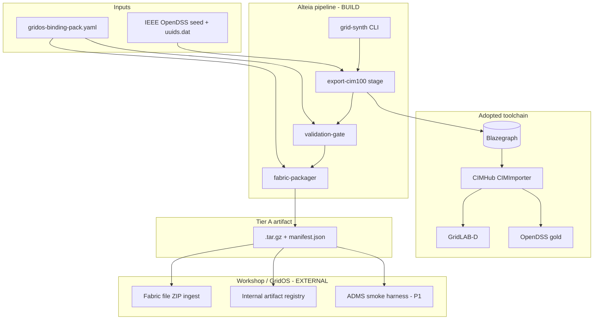
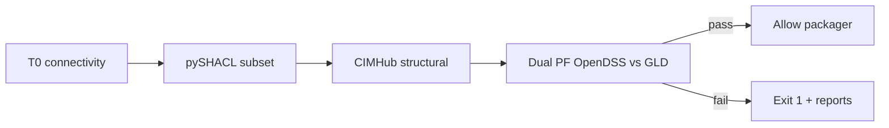
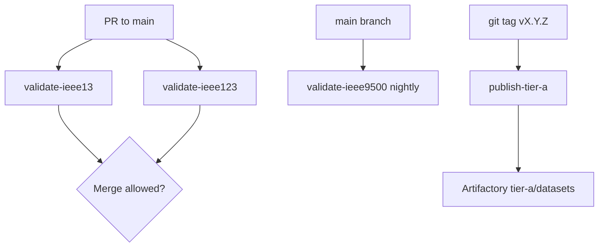

# Architecture Decision Document — Alteia Synthetic Grid Network Data Generator (GridOS)

**Scope:** P0 + P1 only (per PRD §6.1).  
**Normative contracts:** PRD §10 (binding pack, fabric ZIP, manifest, registry).  
**Fast path:** Single-pass architecture from provided PRD, addendum, and technical research (no per-step A/P/C gates).

---

## Executive Summary

v1 is a **container-first data pipeline** with **CDPSM/CIM100 as the canonical hub** (Pattern B, ADR-001). Alteia **adopts** CIMHub, Blazegraph, OpenDSS, and GridLAB-D; **builds** the validation gate, binding-pack integration, fabric ZIP packager, CLI orchestration, and CI/registry publish path.

Promotion to Tier A is blocked until **T0 structural**, **T1 dual PF** (OpenDSS gold vs GridLAB-D), and **pySHACL** pass. Published artifacts are **immutable** `.tar.gz` bundles keyed by **git tag → semver** in the internal registry.

Workshop-gated items (OQ-2–OQ-5) are modeled as **external configuration and sign-off interfaces**—implementation reads authoritative workshop artifacts; this document does not define org-specific class lists, approver identities, or production registry URLs.

---

## Project Context Analysis

### Requirements Overview

**Functional requirements (24 FRs, P0 + P1):**

| Area | FRs | Architectural role |
|------|-----|-------------------|
| Binding pack co-design | FR-1–FR-3 | Versioned YAML contract + SHACL bundle pin; gates all exports |
| CDPSM hub pipeline | FR-4–FR-6 | OpenDSS → Blazegraph → CIMHub roundtrip; IEEE 13 spine |
| Validation gate | FR-7–FR-9 | Composable T0/T1 checks; fail-closed promotion |
| Fabric ZIP + manifest | FR-10–FR-12 | Tier A packager; checksums; T0/T1 labels |
| CLI + CI | FR-13–FR-15 | Typer CLI; PR/nightly/tag jobs |
| IEEE scale-up | FR-16–FR-18 | Same pipeline, feeder-specific AT-* |
| Fabric + ADMS smoke | FR-19–FR-21 | External lab procedures; P1 sign-off boundary |
| Registry | FR-22–FR-24 | Tag-triggered publish; mirrors bundled |

**Non-functional requirements (10 NFRs):** Standards alignment (CDPSM 2021, CIM100), mRID stability, internal-only artifacts, binding-pack release coupling, structured JSON observability, Docker deployment, CI time budget (13+123 < 10 min), 8500/9500 memory bounds (TBD numeric pin), pinned tool versions.

**Scale and complexity:**

- **Domain:** Data/ETL pipeline + scientific validation (not a web product).
- **Complexity:** **High** — multi-language (Python + Java), triple-store, dual solvers, standards conformance, external fabric ingest.
- **Estimated components:** ~12 deployable units (CLI, gate modules, packager, binding loader, CIMHub adapter, Blazegraph sidecar, CI workflows, registry client).

### Technical Constraints and Dependencies

- **ADR-001:** No custom IIDM canonical model in P0–P1.
- **ADR-002:** Adopt CIMHub + Powergrid-Models.
- **ADR-003:** Dual PF = OpenDSS + GridLAB-D only (pandapower non-blocking).
- **D5 / FR-8:** NA unbalanced feeders; pandapower informational only.
- **P-D3:** File-based fabric ZIP ingest (REST deferred).
- **P-D7 / P-D8:** Git tag → semver registry; ADMS smoke only at P1 milestone, not dev publishes.
- **No public CDPSM SHACL:** GridOS subset shapes are co-developed and pinned in binding pack (FR-3).

### Cross-Cutting Concerns

1. **mRID stability** — `uuids.dat` per feeder in source control; gate compares re-export identity.
2. **Binding pack drift** — `binding_pack_version` + `platform_release` in manifest; refresh on GridOS release (NFR-4).
3. **Fail-closed promotion** — Any gate failure → non-zero exit, no ZIP publish.
4. **Artifact immutability** — Semver + checksum policy at registry.
5. **Observability** — Machine-readable `shacl-report.json`, `pf-diff-report.json` on every run.

---

## Starter Template Evaluation

This project is **not** a greenfield web/API starter. Foundation = **integration stack** from technical research and addendum §2.

| Layer | Starter / adopt | Rationale |
|-------|-----------------|-----------|
| Canonical hub | **CIMHub** + Blazegraph | Proven IEEE 13/9500 CDPSM roundtrip ([GRIDAPPSD/CIMHub](https://github.com/GRIDAPPSD/CIMHub)) |
| Graph API | **CIMantic Graphs** (`cimhub_2023`) | FeederModel access for custom checks |
| PF gold | **OpenDSS** (`export cim100`) | Stable mRIDs, NA unbalanced reference |
| PF cross-check | **GridLAB-D** | CIMHub comparison harness |
| Orchestration | **Python 3.10+** (Typer) | pySHACL, CLI, CI glue |
| Deploy | **Docker** multi-stage image | CIMHub Java + Python + OpenDSS + optional GridLAB-D |

**Decision:** No generic Nest/Next starter. Initialize repo as **`alteia-grid-synth`** Python package with `docker/` composition and `.github/workflows/` CI — greenfield **pipeline repo**, brownfield **CIM toolchain**.

---

## Core Architectural Decisions

### Decision Priority Analysis

**Critical (block implementation):**

1. Canonical store = Blazegraph + combined CDPSM XML (not IIDM).
2. Validation gate as explicit pipeline stage before packager.
3. Binding pack v0 schema as single source for tolerances, SHACL path, registry URI template.
4. Fabric ZIP layout v0 (PRD §10.2) — required directory contract.
5. CI: PR validates 13+123; tag publishes; nightly 9500.

**Important:**

- CIMHub invoked via subprocess/JAR wrapper from Python CLI.
- Class subset enforcement via SHACL + optional SPARQL allow-list generated from workshop spec artifact.
- Separate **dev publish** vs **P1 smoke** orchestration flags.

**Deferred (post–P1):** REST API, Tier B CGMES, parameterized synthesis, DifferenceModel, SCADA CSV.

### Data Architecture

| Decision | Choice | Rationale |
|----------|--------|-----------|
| Canonical representation | RDF in Blazegraph + on-disk combined CDPSM XML | Pattern B hub; CIMHub native |
| Feeder seeds | IEEE OpenDSS + checked-in `uuids.dat` | FR-4, NFR-2 |
| Validation reports | JSON files under `validation/` in artifact | NFR-5, FR-9 |
| Published artifact | `.tar.gz` with manifest + checksums | PRD §10.2, A6 |
| Optional metadata DB | **None in v1** | Git + registry sufficient |

### Authentication and Security

| Decision | Choice | Rationale |
|----------|--------|-----------|
| Data classification | Synthetic only; no utility PII | NFR-3 |
| Registry access | CI service principal + AD groups (workshop-defined) | FR-15, §10.5 |
| Artifact distribution | Internal lab registry only | NFR-9, A1 |
| Secrets | CI vault for registry credentials | `svc-alteia-synth-gen-ci` pattern in PRD |

### API and Communication

| Decision | Choice | Rationale |
|----------|--------|-----------|
| External API | **CLI only** (Typer); no REST in v1 | FR-13, non-goals |
| Fabric integration | **File ZIP upload** to lab fabric | P-D3, FR-19 |
| Inter-process | Python CLI → Java CIMHub; pySHACL subprocess | Pragmatic adopt |
| Error contract | Exit codes 0/1/2 (success / validation fail / infra fail) | CI clarity |

### Infrastructure and Deployment

| Decision | Choice | Rationale |
|----------|--------|-----------|
| Runtime | Docker image with pinned CIMHub/Blazegraph/OpenDSS versions | NFR-6, NFR-10 |
| CI platform | GitHub Actions (or org equivalent) | FR-14, FR-15 |
| Publish trigger | **Git tag on `main`** → semver in manifest | P-D7, §10.5 |
| Registry layout | `{base_uri}{dataset_id}/v{semver}/` | FR-22 |
| Large feeders | Git LFS for 8500/9500 seeds if needed | Technical research §7.3 |

### Workshop-Gated Integration Points (OQ-2 – OQ-5)

Implementation **must not hard-code** workshop outcomes in application logic beyond loading external artifacts.

| OQ | Integration point | Architecture assumption | Authoritative source (do not duplicate here) |
|----|-------------------|-------------------------|-----------------------------------------------|
| **OQ-2** | Fabric CDPSM class allow-list | SHACL bundle + optional generated allow-list validator; ingest rejects disallowed classes | `p0-workshop-outcomes-2026-05-27.md` §2; referenced ingest spec (`fabric-cdpsm-ingest-spec-v0.md`); PRD §10.1.1 pointer only |
| **OQ-3** | P0 sign-off gate | Pipeline refuses first P1 fabric-lab promotion until P0 approval record present | PRD §8 milestone; workshop sign-off table |
| **OQ-4** | P1 ADMS QA sign-off | P1 closure requires external smoke reports; not required for dev-registry publish | FR-21, P-D8, §10.4 |
| **OQ-5** | Registry URL + ACLs | Publish client reads `artifact_registry` from binding pack; immutability enforced server-side | PRD §10.5; workshop §4 |

**Binding pack v0** (`gridos-binding-pack.yaml`) is the **runtime join** between code and workshop decisions:

```yaml
# Shape per PRD §10.1 — values loaded at runtime, not compiled into code
binding_version: "<from workshop>"
platform_release: "<from workshop>"
cdpsm_class_subset_ref: "<path or ref to ingest spec artifact>"
fabric_ingest:
  mode: file_zip
artifact_registry:
  base_uri: "<from workshop>"
  publish_principal: "<from workshop>"
validation:
  shacl_bundle: "./shacl/gridos-cdpsm-subset.ttl"
  pf_gate: opendss_gridlabd
  pf_tolerances: { vm_delta_pct_max: 0.1, angle_delta_deg_max: 0.01, source_kw_kvar_delta_pct_max: 0.5 }
```

---

## System Architecture

### High-Level Component Diagram



### CDPSM Hub Pipeline (FR-4 – FR-6)

**Stage 1 — Export (`export-cim100`):**

- Input: feeder id (e.g. `ieee13`), OpenDSS master + `uuids.dat`.
- Action: OpenDSS `export cim100` → combined CDPSM XML (six sub-profiles).
- Output: `work/{feeder}/cim/{feeder}cdpsm.xml`.
- Assert: mRID stability on re-run (byte-compare mRID set or dedicated check).

**Stage 2 — Ingest (`ingest-blazegraph`):**

- Load combined XML to Blazegraph namespace per feeder run.
- Health: SPARQL `ASK` / count query for expected Feeder individual.

**Stage 3 — Roundtrip (`cimhub-roundtrip`):**

- Invoke CIMHub `CIMImporter` with `-o=both` → `render/opendss/`, `render/gridlabd/`.
- CIMHub structural tests must complete without error (AT-*-1).

**Stage 4 — PF agreement (`pf-diff`):**

- Gold: OpenDSS on original seed.
- Compare: GridLAB-D roundtrip vs gold → `validation/pf-diff-report.json`.
- CIMHub roundtrip PF vs gold ≤ 0.1% ΔV (FR-6).
- IEEE 9500: six sample points per AT-9500-2.

### Validation Gate (FR-7 – FR-9)

Gate is a **directed acyclic pipeline**; short-circuit on first failure.



| Gate | Checks | Implementation |
|------|--------|----------------|
| **T0** | Terminals, ConnectivityNodes, feeder scope, dangling terminals | CIMHub tests + custom SHACL cardinalities |
| **SHACL** | GridOS subset bundle from binding pack | pySHACL → `shacl-report.json` |
| **Roundtrip** | Structural integrity post-import | CIMHub test suite |
| **T1 / PF** | vm ≤ 0.1%, angle ≤ 0.01°, source ≤ 0.5% | Parser for solver outputs → `pf-diff-report.json` |

**Pandapower:** Optional sidecar job; results appended as `validation/pandapower-info.json`; **never** sets `pf_gate_status: pass`.

### Fabric ZIP Packager (FR-10 – FR-12)

**Input:** Passing gate outputs + binding pack metadata.  
**Output:** `{dataset_id}-v{semver}.tar.gz` per PRD §10.2.

| Path | Content |
|------|---------|
| `manifest.json` | §10.3 required fields + `git_tag` matching CI tag |
| `cim/{feeder}cdpsm.xml` | Combined CDPSM |
| `validation/shacl-report.json` | `status: pass`, `violation_count: 0` |
| `validation/pf-diff-report.json` | Per-metric deltas + pass/fail |
| `render/opendss/` | Roundtrip mirror |
| `render/gridlabd/` | Roundtrip mirror |
| `render/cgmes/` | Empty or omitted (v1) |

**Manifest generation rules:**

- `validation_tiers: ["T0", "T1"]` only.
- `tier: "A"`.
- `binding_pack_version` must match active `gridos-binding-pack.yaml`.
- SHA-256 for `cim`, `opendss`, `gridlabd` in `artifacts` map.

### CLI (FR-13)

```bash
# Illustrative — actual module names follow repo conventions
grid-synth run --feeder ieee13 --binding-pack config/gridos-binding-pack.yaml --out dist/
grid-synth validate --feeder ieee123 --binding-pack config/gridos-binding-pack.yaml
grid-synth pack --feeder ieee13 --version 1.0.0 --git-tag v1.0.0 --out dist/
```

- Subcommands map 1:1 to pipeline stages; `run` = export → validate → pack.
- `--skip-adms` default true; ADMS smoke is external (FR-21).

### CI and Registry (FR-14 – FR-15, FR-22 – FR-23)



| Job | Trigger | Feeders | SLA |
|-----|---------|---------|-----|
| `validate-ieee13` | PR | 13 | Part of < 10 min combined with 123 |
| `validate-ieee123` | PR | 123 | Part of < 10 min combined |
| `validate-ieee8500` | Nightly or manual | 8500 | Memory bound — **architecture pin:** document in `docs/ci-bounds.md` (from AT-8500-3) |
| `validate-ieee9500` | Nightly | 9500 | Six-point PF |
| `publish-tier-a` | Tag `v*.*.*` on `main` | Tagged feeder set | Push to `{base_uri}{dataset_id}/v{semver}/` |

**Git tag → semver rules (P-D7):**

1. Tag must match semver `vMAJOR.MINOR.PATCH`.
2. `manifest.git_tag` == tag name; `manifest.version` == tag without `v` prefix.
3. Publish job fails if artifact with same semver exists and checksum differs (FR-23).
4. CI uses `publish_principal` credentials from secrets; humans read via `gridos-lab-artifacts-ro` (workshop §4).

**Dev publish vs P1 (P-D8):**

- **Dev/intermediate:** `publish-tier-a` allowed when T0+T1+SHACL pass; ADMS smoke **not** invoked in pipeline.
- **P1 milestone:** External ADMS smoke 4/4 + platform fabric smoke 4/4 required for sign-off — tracked outside CI as gate artifacts.

---

## Implementation Patterns and Consistency Rules

### Naming Patterns

| Artifact | Convention | Example |
|----------|------------|---------|
| Dataset ID | `ieee{nodes}-asbuilt` lowercase | `ieee9500-asbuilt` |
| Feeder CLI arg | short ieee id | `ieee13`, `ieee123` |
| Python modules | `snake_case` | `validation_gate/pf_diff.py` |
| JSON report fields | `snake_case` | `pf_max_vm_delta_pct` |
| CIM files | `{feeder}cdpsm.xml` | `ieee13cdpsm.xml` |
| CI jobs | `validate-ieee{feed}` | `validate-ieee13` |

### Structure Patterns

```
alteia-grid-synth/
├── README.md
├── pyproject.toml
├── config/
│   └── gridos-binding-pack.yaml      # Loaded at runtime; workshop-owned values
├── shacl/
│   └── gridos-cdpsm-subset.ttl       # Path pinned in binding pack
├── feeders/
│   ├── ieee13/
│   │   ├── Master.dss
│   │   └── uuids.dat
│   ├── ieee123/
│   ├── ieee8500/
│   └── ieee9500/
├── src/alteia_grid_synth/
│   ├── cli.py
│   ├── pipeline/
│   │   ├── export_cim100.py
│   │   ├── ingest_blazegraph.py
│   │   ├── cimhub_roundtrip.py
│   │   └── fabric_packager.py
│   ├── validation_gate/
│   │   ├── t0_connectivity.py
│   │   ├── shacl_runner.py
│   │   └── pf_diff.py
│   └── registry/
│       └── publish_client.py
├── docker/
│   ├── Dockerfile
│   └── docker-compose.yml            # Blazegraph + tools
├── tests/
│   ├── unit/
│   └── integration/                  # AT-* mapped tests
├── .github/workflows/
│   ├── validate-pr.yml
│   ├── validate-nightly.yml
│   └── publish-tier-a.yml
└── docs/
    ├── ci-bounds.md
    └── fabric-smoke-procedure.md     # Links to platform doc; no invented API
```

### Format Patterns

**`pf-diff-report.json` (minimum):**

```json
{
  "feeder": "ieee13",
  "pf_gate": "opendss_gridlabd",
  "status": "pass",
  "metrics": {
    "vm_delta_pct_max": 0.05,
    "angle_delta_deg_max": 0.005,
    "source_kw_kvar_delta_pct_max": 0.2
  },
  "samples": []
}
```

**`shacl-report.json`:** `status`, `violation_count`, `violations[]` with `path`, `message`, `focus_node`.

### Process Patterns

- **Fail-closed:** Packager refuses stale reports (must be from same run id / timestamp).
- **Idempotent export:** Same `uuids.dat` → deterministic mRID set check in CI.
- **Binding pack bump:** Any subset or mRID rule change → increment `binding_version` + platform re-approval (FR-2 note).

### Enforcement — All AI Agents MUST

1. Read tolerances and paths from `gridos-binding-pack.yaml`, not constants in code.
2. Never bypass validation gate for publish paths.
3. Not add REST, Tier B, or IIDM canonical model in P0–P1 stories.
4. Treat workshop approver names and class tables as **data**, not code literals.
5. Emit JSON validation reports on every gate stage (NFR-5).

---

## Project Structure and Boundaries

### FR → Module Mapping

| FR group | Module / workflow |
|----------|-------------------|
| FR-1–FR-3 | `config/`, `shacl/`, docs linking to ingest spec |
| FR-4–FR-6 | `pipeline/export_*`, `pipeline/cimhub_*` |
| FR-7–FR-9 | `validation_gate/*` |
| FR-10–FR-12 | `pipeline/fabric_packager.py` |
| FR-13–FR-15 | `cli.py`, `.github/workflows/*` |
| FR-16–FR-18 | `feeders/*` + same pipeline with feeder matrix in CI |
| FR-19–FR-21 | `docs/fabric-smoke-procedure.md` (external execution) |
| FR-22–FR-24 | `registry/publish_client.py`, `publish-tier-a.yml` |

### Architectural Boundaries

| Boundary | Inside Alteia repo | Outside (GridOS / workshop) |
|----------|-------------------|------------------------------|
| CDPSM semantics | Export + roundtrip | Fabric ingest behavior |
| Class allow-list | SHACL + validator config load | Authoritative ingest spec (OQ-2) |
| Promotion policy | Gate + manifest | P0/P1 sign-off records (OQ-3/4) |
| Registry | Publish client | URI, ACLs, immutability policy (OQ-5) |
| ADMS smoke | Criteria doc reference | Marcus-role QA execution (P1) |

### Data Flow

1. OpenDSS seed → CDPSM XML → Blazegraph.  
2. CIMHub → render mirrors → PF metrics.  
3. pySHACL + T0 → reports.  
4. Packager → `.tar.gz`.  
5. Tag CI → registry.  
6. Platform file ingest → fabric (manual/automated lab procedure).  
7. ADMS harness consumes registry URI (P1).

---

## Architecture Validation

### Coherence

| Check | Status |
|-------|--------|
| Hub pattern aligned with ADR-001/002 | Pass |
| PF gate aligned with ADR-003 and FR-8 | Pass |
| No REST/Tier B in v1 paths | Pass |
| Manifest/ZIP contracts match PRD §10 | Pass |
| Workshop items modeled as config interfaces | Pass |

### Requirements Coverage (P0 + P1)

| FR | Architectural support |
|----|----------------------|
| FR-1–FR-3 | Binding pack + SHACL path + external spec refs |
| FR-4–FR-6 | Pipeline stages 1–4 |
| FR-7–FR-9 | Validation gate DAG |
| FR-10–FR-12 | Packager + manifest builder |
| FR-13–FR-15 | CLI + three CI workflows |
| FR-16–FR-18 | Feeder matrix + AT-* in integration tests |
| FR-19–FR-21 | External smoke docs + P1 gate (not CI-block dev publish) |
| FR-22–FR-24 | Registry client + immutability check |

All **NFR-1–NFR-10** addressed in decisions above; **NFR-8** numeric bounds explicitly deferred to `docs/ci-bounds.md` (PRD note).

### Gaps and Follow-Ups

| ID | Gap | Owner | When |
|----|-----|-------|------|
| G-1 | Numeric CI memory/time for 8500/9500 | Alteia + CI | Before AT-8500-3 sign-off |
| G-2 | ADMS smoke script IDs | ADMS QA + Alteia | P1 prep (FR-20) |
| G-3 | Production replacement of tutorial registry URL | Platform workshop | Before prod publish |
| G-4 | GridLAB-D availability in Docker image | DevOps | P0 image build |

### Implementation Sequence (recommended)

1. Docker image with OpenDSS + CIMHub + Blazegraph.  
2. IEEE 13 export + roundtrip (FR-4, FR-5).  
3. Validation gate + reports (FR-7–FR-9).  
4. Packager + manifest (FR-10–FR-12).  
5. CLI `grid-synth run` (FR-13).  
6. `validate-ieee13` CI (FR-14).  
7. Binding pack loader + workshop artifact wiring (FR-1–FR-2).  
8. IEEE 123 + PR budget (FR-16, FR-14).  
9. 8500/9500 nightly + six-point PF (FR-17–FR-18).  
10. `publish-tier-a` on tag (FR-15, FR-22–FR-24).  
11. Fabric + ADMS smoke procedures (FR-19–FR-21) — external.

---

## Completion and Handoff

**Deliverable:** `_bmad-output/planning-artifacts/architecture.md` (this document).

**Next steps:**

1. **`bmad-create-epics-and-stories`** — Slice pipeline modules into stories following implementation sequence.
2. **`bmad-generate-project-context`** — Encode agent rules (binding pack load, fail-closed, no IIDM).
3. **Pin CI bounds** — Resolve G-1 before 8500 promotion stories.

**Normative references for implementers:**

- PRD: `_bmad-output/planning-artifacts/prds/prd-ai-workshop-2026-05-27/prd.md` (§10 contracts)
- Addendum: `_bmad-output/planning-artifacts/briefs/brief-ai-workshop-2026-05-27/addendum.md`
- Technical research: `_bmad-output/planning-artifacts/research/technical-synthetic-electrical-grid-network-data-generator-gridos-cim-cdpsm-research-2026-05-27.md`
- Workshop outcomes (OQ-2–OQ-5 authoritative values): `_bmad-output/planning-artifacts/prds/prd-ai-workshop-2026-05-27/p0-workshop-outcomes-2026-05-27.md`

---

*Architecture workflow complete — status: `complete`, 2026-05-27.*
