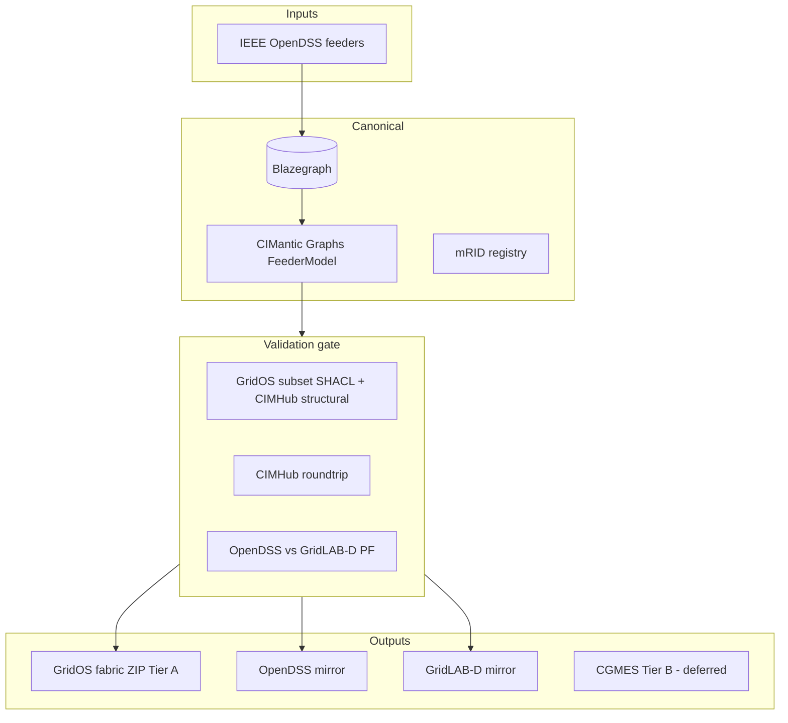

# Addendum — Technical Depth (PRD / Architecture Handoff)

**Parent brief:** `brief.md`  
**Purpose:** Preserve research depth that does not belong in the executive brief. Downstream: PRD (`bmad-prd`), `bmad-create-architecture`, implementation stories.

---

## 1. Canonical architecture (recommended)

**Pattern B — CDPSM/CIM100 hub** with pluggable renderers. Defer custom IIDM-style internal canonical model until fabric proves non-CDPSM extensions are required.



---

## 2. Build vs adopt vs wrap (P0–P1)

| Component | Strategy | Phase |
|-----------|----------|-------|
| CIMHub, Powergrid-Models, OpenDSS, Blazegraph | **Adopt** | P0–P1 |
| CIMantic Graphs (`cimhub_2023`) | **Wrap** | P0–P1 |
| GridOS fabric ZIP packager, binding pack, CI manifest | **Build** | P0 |
| pypowsybl / ENTSO-E SHACL | **Wrap** | Tier B (P1–P2 research only in v1) |
| PowerGridSynth, gridfm-datakit | **Wrap** | P2+ |
| Custom IIDM canonical | **Avoid** | P0 |

---

## 3. CIMHub, validation, and SHACL

### 3.1 CIMHub role

- **CIMHub** ([GRIDAPPSD/CIMHub](https://github.com/GRIDAPPSD/CIMHub)): Blazegraph + Java `CIMImporter` → OpenDSS/GridLAB-D; IEEE 13/9500 CDPSM bundles and roundtrip tests.  
- **OpenDSS** `export cim100` + `uuids.dat` for stable mRIDs.  
- **Combine** six CDPSM sub-profiles (FUN, EP, TOPO, CAT, GEO, SSH) per IEC 61968-13:2021.

### 3.2 SHACL gap

- ENTSO-E publishes production **CGMES v3 SHACL** ([application-profiles-library](https://github.com/entsoe/application-profiles-library)).  
- **No equivalent public SHACL for CDPSM 61968-13:2021** — GridOS Tier A requires **co-developed subset shapes** (CIMTool/CIMHub profile + pySHACL).  
- **Tier B** (deferred): ENTSO-E SHACL after CDPSM→CGMES via PowSyBl.

### 3.3 Validation tiers (T0–T4)

| Tier | Content | Tooling (v1 focus) |
|------|---------|-------------------|
| T0 | Connectivity, terminals, feeder scope | CIMHub + custom SHACL |
| T1 | PF-ready impedances, transformers | OpenDSS solve + spot checks |
| T2 | SCADA mappings | Deferred |
| T3 | Synthetic AMI/CIS | Deferred |
| T4 | DifferenceModel patches | P3 |

---

## 4. P0–P1 pipeline and CI

### 4.1 Step sequence

1. OpenDSS IEEE feeder → `export cim100` + uuids  
2. Combined CDPSM XML → Blazegraph ingest  
3. CIMHub `CIMImporter` roundtrip → OpenDSS + GridLAB-D  
4. PF compare vs gold (≤0.1% V, ≤0.01° angle where applicable, ≤0.5% source kW/kvar)  
5. pySHACL + GridOS subset shapes  
6. On pass → fabric ZIP packager → ADMS smoke (trace + PF)

### 4.2 Dual PF correction

Domain research mentioned OpenDSS + **pandapower**. Technical research corrects: **pandapower cannot analyze typical North American unbalanced feeder line designs**. v1 gate = **OpenDSS (gold) + GridLAB-D**. Pandapower optional on simplified bus-branch projections only—non-blocking for promote.

### 4.3 CI jobs (indicative)

| Job | Trigger |
|-----|---------|
| `validate-ieee13` | PR |
| `validate-ieee9500` | Nightly |
| `publish-tier-a` | Tag → internal registry |
| `validate-tier-b-cgmes` | Weekly — **defer active gate until Tier B** |

### 4.4 Artifact bundle layout

```
ieee9500-asbuilt-v1.0.0/
  manifest.json           # binding_pack_version, tier A, checksums, validation status
  cim/ieee9500cdpsm.xml
  validation/shacl-report.json
  validation/pf-diff-report.json
  render/opendss/
  render/gridlabd/
  render/cgmes/           # Tier B — empty in v1
```

---

## 5. GridOS binding pack (P0 build artifact)

Co-design with platform team. Example schema fields:

```yaml
binding_version: "2026.05.0"
platform_release: "GridOS-TBD"
cdpsm_edition: "IEC-61968-13:2021"
cim_namespace: "http://iec.ch/TC57/CIM100#"
profiles_required: [FUN, EP, TOPO, CAT, GEO, SSH]
mrid_rules:
  stable_uuid: true
  source: opendss_uuids_dat
fabric_ingest:
  container_type: Feeder
  spatial: SubGeographicalRegion required
validation:
  shacl_bundle: "./shacl/gridos-cdpsm-subset.ttl"
  pf_gate: opendss_gridlabd
```

---

## 6. Technology stack (summary)

| Layer | Choice |
|-------|--------|
| Orchestration | Python 3.10+ (CLI Typer/Click, pySHACL) |
| CIM import/conversion | Java CIMHub |
| Triple-store | Blazegraph |
| Graph API | CIMantic Graphs `cimhub_2023` |
| PF gold | OpenDSS / opendsscmd |
| PF cross-check | GridLAB-D |
| CGMES (Tier B later) | pypowsybl |
| Deploy | Docker; K8s Job / GitHub Actions for batch |

---

## 7. Phased roadmap reference (context beyond v1)

| Phase | Focus | Brief status |
|-------|-------|--------------|
| P0 | Binding pack, IEEE 13, ingest spec | **v1** |
| P1 | IEEE 123/8500/9500, fabric + ADMS smoke | **v1** |
| P2 | Parameterized feeders, CGMES Tier B, SCADA CSV | PRD backlog |
| P3 | DifferenceModel, FLISR/outage packs | PRD backlog |
| P4 | Visual Intelligence hooks (geo/mRID only) | **Non-goal v1** |
| P5 | Partner IOP matrices | **Non-goal v1** |

---

## 8. ADRs (technical research)

| ADR | Decision |
|-----|----------|
| ADR-001 | CDPSM/CIM100 hub canonical — not IIDM |
| ADR-002 | Adopt CIMHub + Powergrid-Models P0–P1 |
| ADR-003 | PF gate OpenDSS + GridLAB-D |
| ADR-004 | Tier B CGMES via pypowsybl + ENTSO-E SHACL (deferred) |

---

## 9. Standards anchors

- **Primary:** IEC 61968-13:2021 CDPSM  
- **Partner tier (later):** CGMES EQ/TP/SSH/SV, ENTSO-E conformity patterns  
- **Benchmarks:** IEEE 13, 123, 8500, 9500 (9500 = flagship operational regression)  
- **Versioning:** IEC 61970-552 DifferenceModel for future as-operated (P3)  
- **NA enterprise (later):** MultiSpeak templates

---

## 10. Sources

See domain and technical research documents (2026-05-27) for full bibliography: IEC, ENTSO-E, IEEE PES, EPRI OpenDSS, GridAPPS-D, GE Vernova GridOS product pages.
