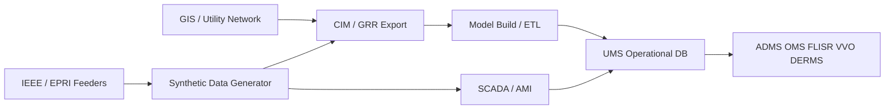

# Synthetic Grid Network Data for UMS Testing: Comprehensive Domain Research

**Date:** 2026-05-27  
**Author:** Bemobrr  
**Research Type:** Domain

---

## Research Overview

Utilities and UMS vendors increasingly need **realistic, standards-aligned, synthetic distribution and transmission network data** to test Advanced Distribution Management Systems (ADMS), Network Management Systems (NMS), Outage Management Systems (OMS), DERMS, and related operational software—without exposing production customer or critical-infrastructure data.

This research maps the **data types** a synthetic generator must produce, the **industry standards** that govern interchange and semantics, and the **test-environment expectations** of major UMS vendors and integration patterns (GIS → CIM → ADMS). Findings are grounded in IEC/ENTSO-E specifications, IEEE benchmark feeders, DOE/NLR test-bed practice, and vendor implementation documentation (Oracle NMS, Schneider ArcFM, GE Vernova, GridAPPS-D).

**Confidence:** High for standards and data-model structure; Medium for market sizing (niche segment, few public figures).

---

## Domain Research Scope Confirmation

**Research Topic:** Synthetic electrical grid network data generation for third-party utility management system (UMS) testing  

**Research Goals:**
- Catalog data types required for credible UMS test datasets
- Map industry standards (CIM, CGMES, IEC 61968, MultiSpeak, IEEE feeders, GIS models)
- Describe what UMS vendors and integrators typically provision in lab/test environments

**Domain Research Scope:** Industry structure, regulatory/standards landscape, technology trends, competitive/ecosystem view, implementation guidance  

**Research Methodology:** Multi-source web verification (IEC, ENTSO-E, IEEE PES, DOE, vendor docs, open-source projects); conflicting vendor-specific details noted explicitly  

**Scope Confirmed:** 2026-05-27

---

# Powering UMS Validation Without Production Data: Domain Research on Synthetic Grid Network Models

## Executive Summary

Third-party testing of Utility Management Systems (UMS)—spanning ADMS, NMS/OMS, DERMS, and enterprise integration layers—depends on a **shared electrical connectivity model** plus layered **engineering, operational, geographic, and telemetry data**. The de facto semantic backbone is the IEC **Common Information Model (CIM)** family (IEC 61970 for EMS/transmission operations, IEC 61968 for distribution and enterprise functions), with **CGMES profiles** for structured exchange and **IEC 61968-13 (CDPSM)** for distribution network analysis.

UMS vendors rarely accept a single flat file: they expect **topology-correct connectivity** (terminals, connectivity nodes, feeder/subnetwork boundaries), **as-built vs as-operated** states, **GIS-aligned spatial context**, and—when testing advanced apps—**SCADA mappings**, **power-flow parameters**, and **scenario libraries** (outages, switching, DER, AMI). Public **IEEE/PNNL/EPRI test feeders** and platforms like **GridAPPS-D** establish benchmark expectations; the **IEEE 9500-node** extension explicitly addresses the gap where vendors previously built proprietary lab models.

**Key findings:**
- Minimum viable synthetic data = connectivity + voltage levels + feeder heads + switch states; ADMS power flow adds impedances, transformer data, conductor catalogs, and optional SCADA/AMI streams.
- Standards alignment (CIM/XML, CGMES EQ/TP/SSH/SV, MultiSpeak for enterprise apps) reduces integration cost and is often contractually required.
- Test environments mirror production topology pipelines (GIS → CIM adapter → model build → validation) with anonymized customer data and UTC-normalized time series.

**Strategic recommendations:**
1. Target **CIM/CDPSM + CGMES subset** export with SHACL-validatable profiles and vendor-specific binding packs.
2. Ship **tiered datasets** (connectivity-only, PF-ready, SCADA-simulated, AMI-enriched) mapped to Oracle/Schneider/GE import paths.
3. Bundle **IEEE 13/123/8500/9500**-scale reference feeders plus stochastic perturbation for scale/stress testing.
4. Provide **IOP-style test cases** (model import, reconfiguration, FLISR trigger, patch/diff exchange) documented per ENTSO-E conformity practice.

---

## Table of Contents

1. [Research Introduction and Methodology](#1-research-introduction-and-methodology)
2. [Core Data Types for Synthetic Grid Networks](#2-core-data-types-for-synthetic-grid-networks)
3. [Industry Standards and Exchange Formats](#3-industry-standards-and-exchange-formats)
4. [What UMS Vendors Need in Test Environments](#4-what-ums-vendors-need-in-test-environments)
5. [Industry and Ecosystem Context](#5-industry-and-ecosystem-context)
6. [Competitive and Solution Landscape](#6-competitive-and-solution-landscape)
7. [Regulatory, Compliance, and Data Governance](#7-regulatory-compliance-and-data-governance)
8. [Technical Trends and Synthetic Data Methods](#8-technical-trends-and-synthetic-data-methods)
9. [Implementation Framework for a Synthetic Data Product](#9-implementation-framework-for-a-synthetic-data-product)
10. [Research Methodology and Sources](#10-research-methodology-and-sources)

---

## 1. Research Introduction and Methodology

### Research Significance

Grid modernization (DER, AMI, FLISR, Volt-VAR optimization) forces UMS products to consume **higher-fidelity network models** than legacy radial GIS exports provided. Vendors and utilities spend months building **lab environments** that replicate GIS→ADMS pipelines; synthetic data products that are **standards-native and scenario-rich** shorten certification, regression testing, and third-party integration projects.

The IEEE PES 9500-node initiative notes vendors historically built **private test models** because no industry-standard feeder met **control-center operational scenario** needs—a direct product opportunity for a synthetic generator aligned to that benchmark ([IEEE 9500-node paper](https://cmte.ieee.org/pes-testfeeders/wp-content/uploads/sites/167/2022/03/9500-Node-PES-TPWRS-Paper-2022.01.14.pdf)).

### Methodology

| Dimension | Approach |
|-----------|----------|
| Scope | Distribution-first (ADMS/DMS/OMS), with transmission/CGMES touchpoints where UMS suites span T&D |
| Sources | IEC/ENTSO-E, IEEE PES, DOE/NLR GridAPPS-D, EPRI CIM primer, vendor implementation guides |
| Verification | Cross-check data types against Oracle NMS ADMS guide, Schneider ArcFM feeder/ADMS docs, GridAPPS-D CDPSM |
| Geography | North America emphasis (MultiSpeak, IEEE feeders); EU CGMES for TSO-style exchanges |
| Limitations | Vendor-proprietary internal schemas not fully public; market size estimates sparse |

---

## 2. Core Data Types for Synthetic Grid Networks

Synthetic generators should emit data in **layers**, each validating independently before composite UMS load.

### 2.1 Topological and Connectivity Model (Mandatory)

| Data category | Representative elements | UMS usage |
|---------------|-------------------------|-----------|
| **Equipment instances** | Breakers, reclosers, fuses, switches, transformers, lines, cables, buses, DER units | Network editor, switching, FLISR |
| **Terminals & connectivity** | Terminal↔ConnectivityNode associations, phases, normal/open status | Energization tracing, isolation |
| **Feeder / subnetwork** | Feeder, Substation, EquipmentContainer, subnetwork controllers | OMS feeder scope, ADMS zones |
| **Geographic context** | SubGeographicalRegion, Location, PositionPoint | Map displays, crew dispatch |
| **As-operated vs as-built** | Switch states, jumper cuts, planned outages, patch deltas | Real-time operations, training sim |

**CIM pattern (GridAPPS-D CDPSM):** Equipment placed in a **Feeder** container; terminals connect at **ConnectivityNodes**; distribution PF often omits TopologicalNode and models buswork explicitly ([CIMHub CDPSM](https://cimhub.readthedocs.io/en/latest/CDPSM.html)).

**GIS-native equivalents:** Esri Utility Network uses **terminals, connectivity rules, subnetwork controllers, containment** for secondary grids and multi-source circuits ([Esri UN for ADMS](https://www.udcus.com/blog/2018/05/22/why-esris-utility-network-model-better-adms)); Schneider ArcFM exports **Geodatabase Regions (GRR)** with `NetworkWithTerminalConnections` graphs ([ArcFM Feeder Services](https://www.productinfo.schneider-electric.com/arcfmsolution/feeder-services-config/Feeder%20Services%20Config/English/Feeder%20Services%20Config%20Guide%20(bookmap)_0000898548.xml/$/GRRsandTracingUNNetworkConnectivityCPT_DD01386647)).

### 2.2 Electrical Engineering Parameters (ADMS / Power Flow)

| Parameter class | Examples | Notes |
|-----------------|----------|-------|
| **Conductor / cable** | R/X/B, ampacity, length, spacing/wire catalog | Required for accurate voltage ([Oracle ADMS guide](https://docs.oracle.com/en/industries/energy-water/network-management-system/251200/nms-adms-implementation-guide/G49136.pdf)) |
| **Transformers** | Windings, taps, impedances, kVA, service transformer sizes | kVA-mode PF minimum set |
| **Voltage levels** | BaseVoltage, nominal kV | Per-bus/device typing |
| **Loads & generation** | P/Q, load models, DER nameplate, dispatch | Scenarios for DER/VVO |
| **Shunt / regulators** | Cap banks, voltage regulators | IEEE 8500/9500 feeders include these |
| **Defaults hierarchy** | GIS → engineering workbook → hardcoded default | Oracle model build pattern |

Oracle documents **tiered PF requirements**: *kVA mode* needs ratings, nominal voltages, transformer levels, service transformer sizes; *full PF* adds conductor catalogs ([Oracle NMS ADMS Implementation Guide](https://docs.oracle.com/en/industries/energy-water/network-management-system/251200/nms-adms-implementation-guide/G49136.pdf)).

### 2.3 Operational and Real-Time Overlay

| Data type | Purpose in test |
|-----------|-----------------|
| **SCADA point mapping** | Device status, lockout, fault indicators, V/I/P/Q, fault current | FLISR, FLA, state estimation |
| **Alarms & events** | Unsolicited outage, recloser lockout, optimization events | OMS/DMS integrated workspace |
| **AMI / pseudo-AMI** | Voltage at secondary, load for VVO | NLR ADMS test-bed use cases ([NLR ADMS Test Bed](https://www.nlr.gov/grid/adms-test-bed)) |
| **Customer / premise** | Account, phone, address (synthetic) | Outage notification, trouble calls |
| **Outage & trouble** | Incidents, calls, crew orders, ETR | OMS regression suites |

Oracle SCADA adapters expect at minimum: **open/closed status, fault indicators, recloser lockout, V, I, P, Q, fault currents** ([Oracle ADMS guide](https://docs.oracle.com/en/industries/energy-water/network-management-system/2601/nms-adms-implementation-guide/F84776.pdf)).

### 2.4 Enterprise and Asset Extensions

| Domain | Standard hook | Typical test need |
|--------|---------------|-------------------|
| Asset registry | IEC 61968-4 profiles | Inspection, lifecycle, work history |
| Work management | IEC 61968-6 messages | Switching orders, field work |
| Metering | MDM / AMI intervals | Load allocation, VVO |
| DERMS | IEC 61968-5 | Dispatch, constraint events |
| Customer | CIS linkage | Outage callbacks (synthetic PII) |

### 2.5 Scenario and Time-Series Data

UMS testing is not static—vendors need **repeatable scenarios**:

- **Switching sequences** (reconfiguration, tie switches, loop closure)
- **Fault / outage injection** (permanent, momentary, lockout)
- **DER ramp** (PV/cloud, EV clusters)
- **Load profiles** (daily/seasonal, heat storm)
- **Market-time snapshots** for CGMES SSH/SV exchange cadence ([ENTSO-E CGMES Building Guide](https://eepublicdownloads.entsoe.eu/clean-documents/CIM_documents/Grid_Model_CIM/CGM%20BUILDING%20PROCESS%20IMPLEMENTATION%20GUIDE_v2.0.pdf))

### 2.6 Data Quality Dimensions (Synthetic Must Simulate)

Utilities report **tens of thousands of GIS connectivity errors** blocking ADMS go-live ([DOE ADMS insights](https://www.energy.gov/sites/default/files/2024-02/11-02-2015_doe-voe-insights-into-advanced-distribution-management-systems-report_508.pdf)). A credible synthetic product should optionally inject **controlled defects** (orphan nodes, wrong phase, missing regulator data) for **validation tooling** tests, plus **gold-standard** clean sets for functional regression.

---

## 3. Industry Standards and Exchange Formats

### 3.1 IEC CIM Family (Semantic Foundation)

| Standard | Scope | Relevance to synthetic UMS data |
|----------|-------|--------------------------------|
| **IEC 61970-301** | CIM base (EMS, SCADA, transmission-oriented) | Core equipment, measurements, topology ([IEC 61970-301:2020](https://webstore.iec.ch/en/publication/62698)) |
| **IEC 61968-11** | CIM distribution extensions | Flexible naming, diagrams, consolidated T&D equipment ([IEC 61968-11:2013](https://webstore.iec.ch/en/publication/6199)) |
| **IEC 61968-13** | CDPSM – distribution network profiles for analysis | **Primary target profile** for distribution PF exchange ([IEC 61968-13:2021](https://webstore.iec.ch/en/publication/34213)) |
| **IEC 61968-4** | Records & asset management messages | Asset copy, network extension, inspection ([IEC 61968-4:2019](https://webstore.iec.ch/en/publication/61452)) |
| **IEC 61970-452/456/457** | CPSM, profiles for EMS exchange | Transmission/substation node-breaker models |
| **IEC 62325** | Market extensions | Market-adjacent UMS, less core for distribution lab |

EPRI summarizes three CIM series: **61970** (grid operations/analysis), **61968** (enterprise + distribution business), unified UML model ([EPRI CIM Primer Ch.1](https://msites.epri.com/rd/research/062333/common-information-model-primer/chapter-1-introduction-to-the-iec-cim)).

### 3.2 CGMES (Common Grid Model Exchange Specification)

CGMES (IEC TS 61970-600-1/600-2) packages CIM into exchange **profiles** for TSO operations and planning ([ENTSO-E CGMES](https://www.entsoe.eu/digital/common-information-model/cim-for-grid-models-exchange/)):

| Profile | Content | Exchange frequency |
|---------|---------|-------------------|
| **EQ** | Equipment physical characteristics | On model change |
| **SSH** | Power flow inputs | Per market time unit |
| **TP** | Topology (buses/connectivity) | Per market time unit |
| **SV** | Power flow results | Per market time unit |
| **DY / DL / GL** | Dynamics, diagrams, geography | Use-case dependent |

**Node/breaker vs bus/branch** modeling levels affect EQ/TP content ([PowSyBl CGMES](https://powsybl.readthedocs.io/projects/powsybl-core/en/v6.7.0/grid_exchange_formats/cgmes/)). ENTSO-E runs **conformity assessment** with SHACL/RDFS validation and IOP tests ([ENTSO-E CIM Conformity](https://www.entsoe.eu/data/cim/cim-conformity-and-interoperability/)).

**Product implication:** A synthetic generator should export **profile bundles** (multi-file RDF/XML CIM) with validation artifacts, not only ad hoc JSON.

### 3.3 MultiSpeak (North American Enterprise Integration)

MultiSpeak defines **XML payloads + WSDL web services** for distribution utility enterprise apps (OMS, MDM, SCADA interfaces, work management) ([MultiSpeak overview](https://www.multispeak.org/what-is-multispeak/)). Listed in **NIST SGIP Catalog of Standards**; prevalent in cooperatives and many IOUs ([NRECA MultiSpeak](https://www.cooperative.com/programs-services/bts/Pages/MultiSpeak.aspx)).

IEC 61968 harmonization with MultiSpeak is documented (mapping CIM elements to MultiSpeak via ESB patterns) ([MDPI CIM interoperability review](https://www.mdpi.com/1996-1073/13/6/1435)).

**Product implication:** Offer **MultiSpeak-shaped exports** for OMS/CIS/MDM integration testing where CIM alone is insufficient.

### 3.4 Benchmark Network Catalogs (De Facto Test Standards)

| Source | Models | Formats | Role |
|--------|--------|---------|------|
| **IEEE PES Test Feeders** | 13, 34, 37, 123, 8500, 9500, comprehensive | OpenDSS, GridLAB-D, CIM, CSV | Algorithm verification, vendor-neutral ADMS scenarios ([IEEE PES Resources](https://cmte.ieee.org/pes-testfeeders/resources/)) |
| **GridAPPS-D Powergrid-Models** | 11 routine feeders + taxonomy | CIM, GLD, OpenDSS | Platform IOP, app development ([GitHub GRIDAPPSD/Powergrid-Models](https://github.com/GRIDAPPSD/Powergrid-Models/)) |
| **PNNL Taxonomy** | 24 prototypical feeders | GridLAB-D (+ population tools) | Statistically representative NA feeders |
| **EPRI Green Circuit / DPV** | Large & PV-heavy circuits | OpenDSS | Scale and DER stress |
| **BetterGrids** | Curated repository | Multiple | Research & benchmarking |

The **9500-node** model was explicitly created so utilities and vendors share a **control-center-grade** reconfigurable feeder with OpenDSS/GridLAB-D/CIM validation ([IEEE 9500 paper](https://cmte.ieee.org/pes-testfeeders/wp-content/uploads/sites/167/2022/03/9500-Node-PES-TPWRS-Paper-2022.01.14.pdf)).

### 3.5 GIS and Vendor-Specific Integration Standards

| Pattern | Description |
|---------|-------------|
| **GIS → CIM XML → ADMS** | Cyient/utility pattern: CIM adapter in GIS, validation on ingest ([GIS-ADMS CIM blog](https://www.cyient.com/blog/toward-seamless-integration-of-gis-and-adms-in-electrical-utilities-with-common-information-model)) |
| **Spec catalog / GRR** | Schneider: ADMS attributes in **spec catalog**, not bloated GIS; GRR encodes connectivity ([ArcFM ADMS spec](https://www.productinfo.schneider-electric.com/arcfmsolution/designer-xi-config/Designer%20XI%20Config/English/Designer%20XI%20Config%20Guide%20(bookmap)_0000282841.xml/$/SpecRequirementsforADMSIntegrationCPT_0001016162)) |
| **CIM difference / patch** | Esri named-version edits → CIM diff for operator approval ([ADMS Patch Integration](https://www.productinfo.schneider-electric.com/arcfmsolution/feeder-services-config/Feeder%20Services%20Config/English/Feeder%20Services%20Config%20Guide%20(bookmap)_0000898548.xml/$/HowtoConfigureADMSPatchIntegrationCPT_DD00821401)) |
| **Network Model Orchestration** | GE Vernova: single fabric across Smallworld GIS & ADMS ([GE GIS-ADMS](https://www.gevernova.com/software/blog/network-based-gis-and-adms-integration-shared-source-truth)) |

### 3.6 Simulation and Solver Interchange

| Format | Use |
|--------|-----|
| **OpenDSS / GridLAB-D** | Distribution PF, quasi-static time series |
| **MATPOWER / PSS/E / UCTE** | Transmission-heavy or research ([Chung-Lu synthesizer](https://github.com/cookbook-ms/chung_lu_chain-synthesizer)) |
| **PowSyBl CGMES** | Import/export validation |
| **IEC 61850 SCL** | Substation IED topology (adjacent to UMS substation modeling) |

---

## 4. What UMS Vendors Need in Test Environments

“UMS” in vendor practice maps to **ADMS + NMS/OMS + SCADA + GIS integration**. Below is a consolidated **test environment checklist** synthesized from Oracle, Schneider, GE, DOE, and NLR sources.

### 4.1 Environment Architecture

| Layer | Typical components |
|-------|-------------------|
| **Database** | Oracle RDBMS (AL32UTF8), UTC timezone, Oracle Locator for spatial ([Oracle NMS Install Guide](https://docs.oracle.com/en/industries/energy-water/network-management-system/251200/nms-installation-guide/G49134.pdf)) |
| **Model store** | Electrical network operations tables + customer model tablespaces |
| **Services** | NMS/ADMS app servers, ISIS messaging bus, SCADA adapters |
| **Integration** | GIS export service, CIM import, optional MultiSpeak endpoints |
| **Simulation** | External PF (e.g., GridAPPS-D), HIL test bed (DNP3/MODBUS) ([NLR ADMS Test Bed](https://www.nlr.gov/grid/adms-test-bed)) |

### 4.2 Minimum vs Advanced Test Datasets

| Tier | Contents | Validates |
|------|----------|-----------|
| **T0 – Connectivity** | Devices, terminals, nodes, feeders, switch states | Tracing, switching orders, map sync |
| **T1 – PF-ready** | T0 + impedances, transformer data, conductor catalog | Load flow, voltage drop, FLA |
| **T2 – Operations** | T1 + SCADA mappings + event scripts | FLISR, lockout, RT status |
| **T3 – Enterprise** | T2 + synthetic AMI/CIS + MultiSpeak messages | OMS callbacks, MDM, VVO with AMI |
| **T4 – Patch / delta** | Initial vs patched CIM diffs | Change management, training |

### 4.3 Vendor-Specific Expectations

**Oracle Utilities NMS / ADMS**
- Single **NMS model** shared by OMS and DMS modules—no separate sync ([Oracle ADMS guide](https://docs.oracle.com/en/industries/energy-water/network-management-system/251200/nms-adms-implementation-guide/G49136.pdf))
- Model build via **Distribution Model Workbook** + optional **Powerflow Engineering Data** workbook
- Data precedence: GIS → Powerflow workbook → defaults
- SCADA-driven events: FLISR, FLA, optimization, DER events ([Oracle ADMS guide](https://docs.oracle.com/en/industries/energy-water/network-management-system/2601/nms-adms-implementation-guide/F84776.pdf))
- **Reference models / testing accelerator** assets for cloud CIS/C2M ([Oracle URMS](https://docs.oracle.com/en/industries/utilities/urms/index.html))

**Schneider Electric (EcoStruxure ADMS / ArcFM)**
- **High-fidelity spec catalog** rather than ADMS fields in GIS ([Spec requirements](https://www.productinfo.schneider-electric.com/arcfmsolution/designer-xi-config/Designer%20XI%20Config/English/Designer%20XI%20Config%20Guide%20(bookmap)_0000282841.xml/$/SpecRequirementsforADMSIntegrationCPT_0001016162))
- **GRR** exports from Utility Network with feeder sources and terminal graphs
- **ADMS patch integration**: SDE default vs patched version → CIM differences ([Patch integration](https://www.productinfo.schneider-electric.com/arcfmsolution/feeder-services-config/Feeder%20Services%20Config/English/Feeder%20Services%20Config%20Guide%20(bookmap)_0000898548.xml/$/HowtoConfigureADMSPatchIntegrationCPT_DD00821401))

**GE Vernova**
- **Network Model Orchestration**—one as-built/as-operated model across GIS and ADMS
- Claims: up to **30% lower integration cost**, **50% fewer sync errors** with integrated GIS-ADMS ([GE blog](https://www.gevernova.com/software/blog/network-based-gis-and-adms-integration-shared-source-truth))

**GridAPPS-D (vendor-neutral R&D platform)**
- CIM triple-store + messaging for app portability ([GridAPPS-D About](https://gridapps-d.org/about))
- Eleven standard feeders for regression; encourages **CIM-compliant interfaces** for DMS vendors

### 4.4 Test Scenarios Vendors Run

| Scenario class | Required data fidelity |
|----------------|------------------------|
| Model import / validation | CIM/CDPSM conformance, no dangling connectivity |
| Feeder reconfiguration | Switch tables, tie points, subnetwork controllers |
| Permanent fault + lockout | SCADA status + fault current + FLISR paths |
| Momentary / recloser | Event sequencing |
| VVO / CVR | Cap regulators, AMI voltages |
| DER dispatch / constraint | DER nameplate, fuel/forecast for utility-scale DER |
| GIS patch approval | CIM diff initial/final states |
| Training / DR | Operator workspace events, synthetic customers |

### 4.5 Third-Party Testing Deliverables (Recommended Package)

For a synthetic data product sold to vendors or integrators:

1. **CIM/CDPSM XML** + SHACL validation report  
2. **CGMES profile bundle** (EQ+TP+SSH, optional SV golden)  
3. **OpenDSS/GridLAB-D mirrors** for independent PF proof  
4. **SCADA point list** (CSV/JSON) keyed to device mRID  
5. **Scenario scripts** (YAML): fault times, switch orders, load multipliers  
6. **Synthetic CIS/AMI** (no real PII; GDPR-safe patterns)  
7. **Import runbook** per target vendor (Oracle workbook mapping notes, ArcFM GRR field map)  
8. **IOP test matrix** aligned to ENTSO-E FAT/SAT style cases ([ENTSO-E IOP](https://www.entsoe.eu/data/cim/cim-conformity-and-interoperability/))

---

## 5. Industry and Ecosystem Context

### Market Dynamics

- **ADMS/DMS market** is driven by grid modernization, outage reduction, and DER—not easily isolated from “synthetic data,” but growth in **digital twin** and **model-driven testing** expands addressable need.
- **Pain point:** Multi-year GIS remediation before ADMS go-live ([DOE report](https://www.energy.gov/sites/default/files/2024-02/11-02-2015_doe-voe-insights-into-advanced-distribution-management-systems-report_508.pdf)) → **synthetic gold models** accelerate vendor QA and utility UAT.
- **Public investment:** DOE GridAPPS-D, NLR ADMS Test Bed fund **vendor-neutral** interoperability ([NLR ADMS](https://www.nlr.gov/grid/advanced-distribution-management)).

### Value Chain

### Segmentation

| Segment | Synthetic data need |
|---------|-------------------|
| **UMS vendors** | Regression, demo, certification, IOP |
| **System integrators** | Migration rehearsal, CIM mapping tests |
| **Utilities** | Training, sandbox, anonymized what-if |
| **Researchers / AI** | ML PF/OPF datasets ([gridfm-datakit](https://github.com/gridfm/gridfm-datakit)) |

---

## 6. Competitive and Solution Landscape

### Categories of Solutions

| Category | Examples | Gap vs UMS-focused synthetic network product |
|----------|----------|-----------------------------------------------|
| **Benchmark feeders** | IEEE, EPRI, PNNL, BetterGrids | Fixed topology; limited enterprise/SCADA layers |
| **Research synthesizers** | gridfm-datakit, Chung-Lu-Chain | PF/ML-oriented; weak OMS/CIS/MultiSpeak |
| **Platform test beds** | GridAPPS-D, NLR ADMS Test Bed | Environment, not commercial data SKU |
| **Vendor reference models** | Oracle URMS accelerators | Tied to vendor stack |
| **GIS vendors** | Esri UN, Schneider ArcFM | Source of truth, not synthetic factory |

### Key Players (Integration / Standards)

- **Standards bodies:** IEC, ENTSO-E, UCAIug (CIM management: [CIM Modeling Guide](https://cim-mg.ucaiug.io/latest/section9-artifacts-under-cim-management/))
- **UMS vendors:** Oracle, Schneider Electric, GE Vernova, Hitachi Energy, Survalent, etc.
- **GIS:** Esri, Schneider ArcFM, GE Smallworld
- **Open tooling:** PowSyBl, pandapower, CIMHub, GridAPPS-D

### Differentiation Opportunities

- **Profile-aware validation** (CDPSM + CGMES + vendor binding)
- **Operational scenario packs** (FLISR/FLA scripts with SCADA)
- **Scale elasticity** (IEEE 13 → 9500 → synthetic city-scale)
- **Defect injection / data quality scoring** for migration tooling QA

---

## 7. Regulatory, Compliance, and Data Governance

### Standards Compliance (Product Requirements)

- Align exports with **IEC 61968-13:2021** CDPSM for distribution network exchange.
- For TSO-style or large transmission interfaces, support **CGMES** conformity patterns ([ENTSO-E](https://www.entsoe.eu/data/cim/cim-conformity-and-interoperability/)).
- North American enterprise tests: **MultiSpeak** message contracts.

### Privacy and Security

- Synthetic data must **not reconstruct** real customer locations or critical infrastructure details.
- Training environments should use **fabricated CIS records**; avoid copying real AMI intervals that could enable re-identification.
- NERC CIP considerations apply to **production** environments, not public feeders—but vendor labs handling utility-derived data need sanitization workflows.

### Safety and Engineering Liability

- Synthetic parameters must be **physically plausible** (voltage bands, thermal limits) when used for **operator training** misconfiguration could normalize unsafe switching if scenarios are unrealistic.

---

## 8. Technical Trends and Synthetic Data Methods

### Emerging Approaches

| Method | Description | Source |
|--------|-------------|--------|
| **Graph synthesis** | Chung-Lu-Chain transmission + Schweitzer radial feeders | [GitHub CLC synthesizer](https://github.com/cookbook-ms/chung_lu_chain-synthesizer) |
| **Stochastic PF/OPF datasets** | Load/DER/topology perturbation at 10k–30k buses | [gridfm-datakit](https://github.com/gridfm/gridfm-datakit) |
| **Feeder modernization** | 8500 → 9500 reconfigurable operational model | [PNNL-33471](https://www.pnnl.gov/main/publications/external/technical_reports/PNNL-33471.pdf) |
| **CIM triple-store + messaging** | App portability, federated simulation | [GridAPPS-D](https://gridapps-d.org/about) |
| **Hardware-in-the-loop** | ADMS + DNP3/MODBUS field simulation | [NLR Test Bed](https://www.nlr.gov/grid/adms-test-bed) |

### Digital Twin Convergence

Integrated **GIS-ADMS** orchestration treats the network model as a **living digital twin** (as-built/as-operated). Synthetic generators should support **versioned model branches** and **diff exports** matching patch-integration patterns.

### AI / ML Overlap

ML power-flow libraries need **structured per-bus/per-branch tensors** ([arxiv gridfm-datakit](https://arxiv.org/pdf/2512.14658)). UMS testing needs **semantics + connectivity + SCADA**. Product strategy: **one canonical CIM model → multiple renderers** (ML tensors, OpenDSS, vendor workbooks).

---

## 9. Implementation Framework for a Synthetic Data Product

### Phased Delivery

| Phase | Deliverable | Success criteria |
|-------|-------------|------------------|
| **P1** | IEEE 13/123/8500 in CDPSM CIM + validation | Imports cleanly to PowSyBl/CIMHub |
| **P2** | Parameterized feeder generator (radial + secondary) | PF within tolerance vs OpenDSS gold |
| **P3** | SCADA + outage scenario packs | Triggers vendor FLISR/FLA test cases |
| **P4** | MultiSpeak + synthetic CIS/AMI | OMS enterprise integration tests |
| **P5** | Patch/diff + GIS-roundtrip | Schneider/Oracle patch workflows |

### Risk Assessment

| Risk | Mitigation |
|------|------------|
| Vendor schema drift | Versioned “binding packs” per UMS release |
| CIM profile mismatch | SHACL validation + ENTSO-E-style IOP cases |
| Unrealistic physics | Dual validation OpenDSS + pandapower |
| Regulatory sensitivity | No real utility IDs; documented anonymization |

### Strategic Recommendations (Immediate)

1. **Adopt CDPSM + CGMES EQ/TP/SSH as core export**, with IEEE 9500 as flagship reference dataset.  
2. **Publish tiered test kits** (T0–T4) with vendor import notes for Oracle workbook and ArcFM GRR.  
3. **Partner or align with GridAPPS-D/BetterGrids** for credibility in R&D and vendor IOP.  
4. **Offer scenario DSL** for FLISR/FLA/outage regression comparable to Oracle event types.  
5. **Build validation CLI** (gridfm-style) adapted to **CIM connectivity rules**, not only AC-PF limits.

---

## 10. Research Methodology and Sources

### Primary Authoritative Sources

- IEC 61970-301, 61968-11/13/4 (webstore.iec.ch)
- ENTSO-E CGMES and conformity framework (entsoe.eu)
- IEEE PES Test Feeders (cmte.ieee.org/pes-testfeeders)
- GridAPPS-D Powergrid-Models (github.com/GRIDAPPSD/Powergrid-Models)
- Oracle NMS ADMS Implementation & Installation Guides (docs.oracle.com)
- Schneider ArcFM Feeder Services / Designer XI docs (productinfo.schneider-electric.com)
- DOE ADMS insights report (energy.gov)
- NLR ADMS Test Bed (nlr.gov)

### Web Search Queries Used

- IEC 61968 61970 CIM utility network data model  
- utility management system test environment network model  
- synthetic power grid network data ADMS DMS  
- CIM CGMES power system model exchange test data  
- MultiSpeak utility data exchange  
- GridAPPS-D test feeder CIM  
- IEEE distribution test feeders OpenDSS  
- Schneider GE ADMS GIS integration test  
- IEC 61968-13 CDPSM distribution  
- Oracle NMS SCADA ADMS test scenarios  

### Confidence Levels

| Topic | Confidence | Notes |
|-------|------------|-------|
| CIM/CGMES data types | High | IEC & ENTSO-E aligned |
| Oracle NMS test needs | High | Official implementation guides |
| Schneider/GE patterns | Medium-High | Vendor docs; some features version-specific |
| Market size | Low | No direct public TAM for synthetic UMS data |
| Exact proprietary schemas | Low | Not fully published |

### Limitations

- Does not include confidential utility RFP requirements or per-tenant custom CIM extensions.  
- Transmission EMS (EMS-only) scenarios covered via CGMES but not exhaustively.  
- Real-time protocol specs (DNP3 point lists) vary by RTU vendor—scenario packs should be templates.

---

## Research Conclusion

Synthetic electrical grid network data for UMS testing is not a single dump of line segments—it is a **layered, standards-governed product** spanning **CIM connectivity**, **engineering parameters**, **operational overlays**, and **scenario time series**, validated against **public benchmark feeders** and **vendor import pipelines**. The strongest standards anchors are **IEC 61968-13 (CDPSM)** and **CGMES profiles**; the strongest procedural reference is **ENTSO-E-style conformity and IOP testing**. UMS vendors consistently need **topology-accurate models with GIS-consistent exports**, **tiered PF fidelity**, and **SCADA-driven event scripts** in **UTC-normalized** lab environments.

**Recommended next steps for product teams:** (1) prototype CDPSM export from a parameterized IEEE 123 feeder; (2) run import validation with target vendor toolchain; (3) add FLISR scenario pack with SCADA mapping template; (4) document conformance test matrix for third-party certification offerings.

---

**Research Completion Date:** 2026-05-27  
**Document Status:** Complete (workflow steps 1–6)  
**Source Verification:** Factual claims tied to cited public sources above
