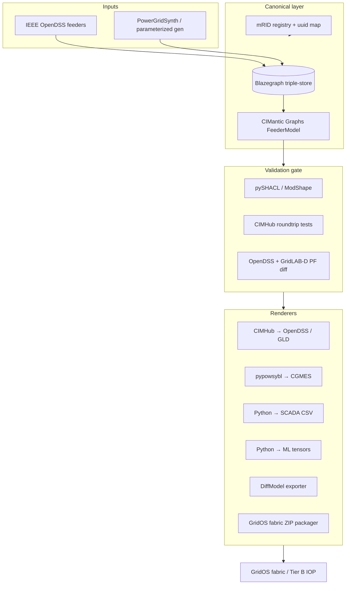
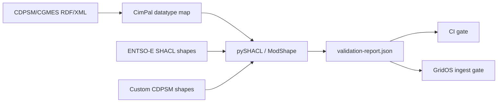
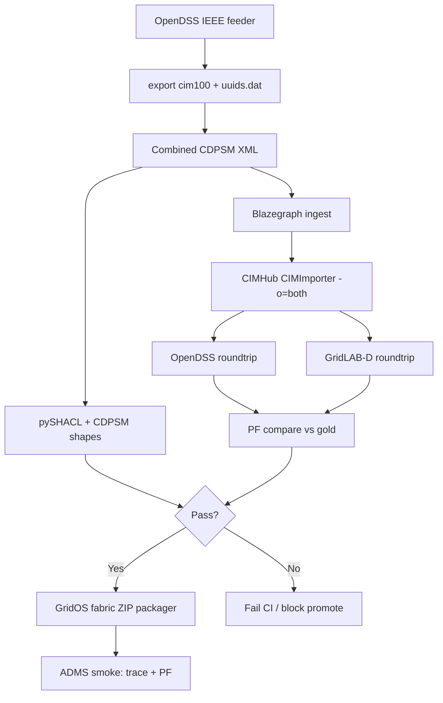

# Research Report: technical

**Date:** 2026-05-27  
**Author:** Bemobrr  
**Research Type:** Technical  

---

## Research Overview

This technical research builds on completed domain research for an **Alteia-developed synthetic electrical grid network data generator** targeting **GE Vernova GridOS** (federated data fabric, ADMS, DERMS, Network Model Orchestration) with optional **Tier B** exports for third-party UMS IOP. It evaluates architecture patterns, open-source and commercial building blocks, validation tooling, a P0–P1 prototype path, runtime/deployment options, and concrete mitigations for fabric binding drift, profile mismatch, and unrealistic physics.

**Primary recommendation:** Adopt a **canonical CDPSM hub** (CIM100 RDF in a triple-store or CIMantic Graphs in-memory model) with **pluggable renderers**, seed **IEEE benchmark feeders** via **OpenDSS → CDPSM export**, validate with **CIMHub roundtrip + OpenDSS/GridLAB-D dual PF**, and gate fabric promotion behind a **SHACL/pySHACL validation pipeline** plus a **versioned GridOS binding pack**. Defer Visual Intelligence / imagery (P4) and treat **pandapower** as a secondary validator—not the primary NA unbalanced distribution solver.

See the **Executive Summary** and full sections below for detailed findings, build/adopt/wrap matrix, and phased implementation guidance.

---

## Technical Research Scope Confirmation

**Research Topic:** Synthetic electrical grid network data generator architecture for GridOS (CIM/CDPSM canonical model, multi-renderer exports, validation, and deployment)

**Research Goals:**
1. Architecture options for a canonical CIM/CDPSM model with multiple renderers (OpenDSS, GridLAB-D, CGMES, SCADA point lists, ML tensors)
2. Evaluate open-source and commercial building blocks: PowSyBl, pandapower, CIMHub, GridAPPS-D Powergrid-Models, IEEE feeder tooling, graph synthesizers (Chung-Lu-Chain), gridfm-datakit — build vs adopt vs wrap
3. CIM validation and profile tooling (SHACL, ENTSO-E IOP patterns, CDPSM 61968-13:2021)
4. Prototype path aligned to domain P0–P1: IEEE 13/123/8500/9500 → CDPSM → fabric-ready ingest; dual PF validation (OpenDSS + pandapower) before ADMS promotion
5. Runtime/deployment: CLI vs API vs batch jobs; versioning for as-built/as-operated; test data packaging and CI-friendly artifacts
6. Risks from domain research: fabric binding drift, profile mismatch, unrealistic physics — mitigations with concrete tech choices

**Technical Research Scope:**
- Architecture Analysis — design patterns, frameworks, system architecture
- Implementation Approaches — development methodologies, coding patterns
- Technology Stack — languages, frameworks, tools, platforms
- Integration Patterns — APIs, protocols, interoperability
- Performance Considerations — scalability, optimization, patterns

**Research Methodology:**
- Current web data with rigorous source verification (IEC, ENTSO-E, EPRI, PNNL, IEEE PES, LF Energy, GitHub project docs)
- Multi-source validation for critical technical claims
- Confidence level framework for uncertain information
- Primary input: domain research artifact dated 2026-05-27

**Scope Confirmed:** 2026-05-27

---

# Canonical CDPSM Hub Architecture for GridOS Synthetic Network Data: Comprehensive Technical Research

## Executive Summary

GridOS ADMS/DERMS regression and Network Model Orchestration require **standards-native, versioned, connectivity-correct distribution models**—not ad hoc flat exports. The technically sound approach for Alteia's generator is a **hub-and-spoke architecture** with **IEC 61968-13 (CDPSM) / CIM100** as the canonical semantic layer and **renderer plugins** producing OpenDSS, GridLAB-D, CGMES, SCADA point lists, and ML tensors from the same mRID-stable source graph.

**Key technical findings:**

- **Proven reference pattern:** GridAPPS-D **CIMHub** already implements the canonical-hub model (Blazegraph triple-store + Java CIMImporter → OpenDSS/GridLAB-D), with IEEE 13/9500 CDPSM bundles and OpenDSS↔GridLAB-D PF comparison tests ([CIMHub](https://github.com/GRIDAPPSD/CIMHub), [OpenDSS CIM100](https://opendss.epri.com/CommonInformationModelCIM100.html)).
- **Build vs adopt:** **Adopt** CIMHub + Powergrid-Models for P0–P1; **wrap** PowSyBl/pypowsybl for Tier B CGMES; **wrap** PowerGridSynth and gridfm-datakit for P2+ parameterized/ML outputs; **build** GridOS fabric binding pack, scenario packs, and CI artifact packaging in-house.
- **Validation gap:** ENTSO-E publishes production-grade **SHACL** for CGMES v3.0 ([application-profiles-library](https://github.com/entsoe/application-profiles-library)); **CDPSM 61968-13:2021 has no equivalent public SHACL bundle**—custom shapes from CIMTool/CIMHub profile plus structural checks are required.
- **Dual PF caveat:** Domain research recommends OpenDSS + pandapower; **pandapower explicitly cannot analyze typical North American unbalanced feeder line designs** ([pandapower about](https://www.pandapower.org/about/)). For IEEE NA feeders, **OpenDSS + GridLAB-D** (CIMHub's existing comparison harness) is the correct dual-solver gate; add **pandapower only on simplified bus-branch projections** or European-style 3-phase subsets.
- **Versioning:** **IEC 61970-552 DifferenceModel** with `md:Model` headers (`scenarioTime`, `version`) supports as-built/as-operated deltas aligned to Network Model Orchestration and partner patch IOP ([ENTSO-E Metadata spec](https://www.entsoe.eu/Documents/CIM_documents/Grid_Model_CIM/MetadataAndHeaderDataExchangeSpecification_v2.3.0.pdf)).

**Top technical recommendations:**

1. **P0 architecture:** Canonical store = **Blazegraph + CIMantic Graphs (`cimhub_2023` profile)**; renderers = CIMHub (OpenDSS/GLD), custom Python (SCADA CSV, fabric ZIP), pypowsybl (CGMES Tier B).
2. **P1 prototype:** Promote **IEEE 13 → 123 → 8500 → 9500** via OpenDSS `export cim100` → combined CDPSM → CIMHub roundtrip → dual PF (OpenDSS + GridLAB-D) → fabric smoke ingest.
3. **Validation pipeline:** pySHACL + ENTSO-E shapes (CGMES Tier B); CIMHub structural tests + custom CDPSM shapes (GridOS Tier A); golden PF vectors checked in CI.
4. **Deployment:** **CLI + batch jobs** for CI; optional **REST API** for GridOS lab; **OCI/tar artifacts** with manifest, SHACL report, PF diff report, and binding-pack version pin.
5. **Risk controls:** Versioned **GridOS binding pack** per platform release; **mRID registry** (`uuids.dat` pattern from OpenDSS); physics gate via **OpenDSS gold + GridLAB-D cross-check** before ADMS promotion.

---

## Table of Contents

1. [Technical Research Introduction and Methodology](#1-technical-research-introduction-and-methodology)
2. [Architecture Options: Canonical CIM/CDPSM with Multiple Renderers](#2-architecture-options-canonical-cimcdpsm-with-multiple-renderers)
3. [Building Block Evaluation: Build vs Adopt vs Wrap](#3-building-block-evaluation-build-vs-adopt-vs-wrap)
4. [CIM Validation and Profile Tooling](#4-cim-validation-and-profile-tooling)
5. [P0–P1 Prototype Path](#5-p0p1-prototype-path)
6. [Runtime, Deployment, and CI Packaging](#6-runtime-deployment-and-ci-packaging)
7. [Technology Stack Analysis](#7-technology-stack-analysis)
8. [Integration and Interoperability Patterns](#8-integration-and-interoperability-patterns)
9. [Performance and Scalability](#9-performance-and-scalability)
10. [Risk Assessment and Mitigations](#10-risk-assessment-and-mitigations)
11. [Strategic Technical Recommendations and Roadmap](#11-strategic-technical-recommendations-and-roadmap)
12. [Technical Research Methodology and Sources](#12-technical-research-methodology-and-sources)
13. [Technical Appendices](#13-technical-appendices)

---

## 1. Technical Research Introduction and Methodology

### 1.1 Technical significance

Domain research established that GridOS test environments must mirror **Network Model Orchestration** (Smallworld ↔ federated fabric ↔ ADMS/DERMS), not only generic GIS→CIM import. The technical challenge for Alteia is engineering a **repeatable generator pipeline** that:

- Maintains **one canonical electrical semantics graph** (CDPSM/CIM100)
- Emits **multiple downstream formats** without semantic drift
- Proves **physical plausibility** before ADMS load
- Supports **as-built / as-operated versioning** for orchestration scenarios
- Packages **CI-friendly artifacts** for GridOS QA and optional Tier B IOP

The IEEE 9500-node initiative explicitly created a **control-center-grade, multi-format benchmark** (OpenDSS, GridLAB-D, CIM, CSV) because vendors lacked a shared operational-scale feeder ([IEEE 9500 paper](https://cmte.ieee.org/pes-testfeeders/wp-content/uploads/sites/167/2022/03/9500-Node-PES-TPWRS-Paper-2022.01.14.pdf)). Alteia should treat this as the **flagship technical regression target**, not reinvent conversion mechanics.

### 1.2 Methodology

| Dimension | Approach |
|-----------|----------|
| **Primary input** | Domain research artifact (2026-05-27), GridOS-first P0–P5 phasing |
| **Technical depth** | Distribution network generation and standards export (deep); Visual Intelligence / imagery (P4 defer) |
| **Sources** | IEC/ENTSO-E standards pages, EPRI OpenDSS docs, PNNL/GridAPPS-D tooling, LF Energy PowSyBl, peer-reviewed synthesizers |
| **Verification** | Cross-check architecture claims against CIMHub, PowSyBl, ENTSO-E SHACL library, pandapower limitations |
| **Confidence** | High for open-source tooling capabilities; Medium for GridOS fabric ingest APIs (not fully public) |

### 1.3 Goals achieved

| Goal | Outcome |
|------|---------|
| Architecture options | Three viable patterns evaluated; **Hub-and-spoke (Pattern B)** recommended |
| Building blocks | Build/adopt/wrap matrix with phase mapping |
| Validation tooling | SHACL stack + CDPSM gap analysis + IOP alignment |
| P0–P1 prototype | Step-by-step pipeline with solver correction |
| Runtime/deployment | CLI/batch/API split + artifact manifest schema |
| Risk mitigations | Concrete tooling per domain risk |

---

## 2. Architecture Options: Canonical CIM/CDPSM with Multiple Renderers

### 2.1 Design principles (from CIM platform practice)

PNNL's CIM platform guidance describes CIM as a **canonical information model** where applications map to a shared semantic layer rather than pairwise converters ([PNNL CIM platform paper](https://www.osti.gov/servlets/purl/1922947)). The GridAPPS-D **CIMHub** implements this literally: CIM is the hub; OpenDSS and GridLAB-D are spokes ([CIMHub README](https://github.com/GRIDAPPSD/CIMHub)).

For Alteia/GridOS, additional spokes are required:

| Renderer | Consumer | Priority |
|----------|----------|----------|
| **GridOS fabric CDPSM bundle** | Federated data fabric, NMO | P0 (Tier A) |
| **OpenDSS** | Independent PF gold, ADMS-adjacent QA | P0 |
| **GridLAB-D** | Cross-solver PF validation, GridAPPS-D parity | P0 |
| **CGMES (EQ/TP/SSH/SV)** | Tier B ENTSO-E-style IOP | P1–P2 |
| **SCADA point list (CSV/JSON)** | FLISR/RT overlay scenarios | P2 |
| **ML tensor bundles** | Internal AI/analytics experiments | P2+ |
| **IEC 61970-552 DifferenceModel** | As-operated patches | P3 |

### 2.2 Pattern A — Internal domain model (IIDM-style)

**Description:** Maintain a custom in-memory network model (similar to PowSyBl **IIDM**) as canonical; compile to CIM/CDPSM and other formats on export.

| Pros | Cons |
|------|------|
| Full control over GridOS-specific extensions | High build cost; duplicates PowSyBl/CIMHub semantics |
| Efficient PF validation in Java | Risk of CIM profile drift from standard |
| Clean renderer API | Team must own UML/profile evolution |

**Verdict:** **Defer.** Only justified if GridOS fabric requires proprietary extensions not expressible in CDPSM. Until P0 fabric ingest spec is confirmed, do not build a parallel canonical model.

### 2.3 Pattern B — CIM/CDPSM hub (recommended)

**Description:** Canonical state = **RDF graph** (CDPSM/CIM100) in triple-store and/or **CIMantic Graphs** in-memory `FeederModel`. Renderers read via SPARQL or graph API.



**Evidence base:** CIMHub converts IEEE 13 CDPSM ↔ OpenDSS ↔ GridLAB-D with documented PF comparison tests ([CIMHub tests](https://github.com/GRIDAPPSD/CIMHub)). CIMantic Graphs provides `FeederModel` with `cimhub_2023` profile for programmatic graph access without custom SPARQL ([CIMantic feeder model](https://cimantic-graphs.readthedocs.io/en/latest/04_graph_models/4_2_feeder_model.html)).

**Verdict:** **Adopt for P0–P3.** Lowest time-to-fabric with standards alignment.

### 2.4 Pattern C — Solver-first (OpenDSS as source of truth)

**Description:** OpenDSS files are canonical; CDPSM is export-only snapshot.

| Pros | Cons |
|------|------|
| Fastest IEEE feeder onboarding | Weak as-built/as-operated semantics |
| Native NA unbalanced PF | Fabric expects CIM-first ingest |
| EPRI-maintained CDPSM export | mRID stability requires discipline |

**Verdict:** **Use as ingestion path only**, not as long-term canonical store. OpenDSS `export cim100` + `uuids` file provides stable mRIDs ([OpenDSS CIM100](https://opendss.epri.com/CommonInformationModelCIM100.html)), but orchestration scenarios need CIM-native diff and metadata headers.

### 2.5 Renderer interface (recommended build)

Define a small internal **Renderer** contract regardless of hub pattern:

```python
class Renderer(Protocol):
    name: str
    target_format: str  # e.g. "opendss", "cgmes-eq", "scada-csv"
    def render(self, feeder_mrid: str, ctx: RenderContext) -> ArtifactBundle: ...
```

`RenderContext` carries: triple-store endpoint or `FeederModel`, profile version (`cimhub_2023`), as-built vs as-operated branch ID, GridOS binding pack version, and validation policy (strict vs lab).

**New build scope (Alteia-owned):**
- GridOS fabric packager (ZIP + manifest + binding metadata)
- SCADA point list generator (maps `Measurement` / synthetic analogs to mRID-keyed CSV)
- ML tensor exporter (tabular join on bus/branch mRIDs)
- DifferenceModel builder for switch-state scenarios (IEC 61970-552)

**Wrap/adopt scope:**
- OpenDSS/GridLAB-D via CIMHub
- CGMES via pypowsybl
- SHACL via pySHACL + ENTSO-E artifacts

### 2.6 As-built / as-operated branching

Network Model Orchestration requires **versioned model states**. Technically:

- **As-built:** Base CDPSM FullModel with `md:Model.version` increment per release ([ENTSO-E Metadata spec](https://www.entsoe.eu/Documents/CIM_documents/Grid_Model_CIM/MetadataAndHeaderDataExchangeSpecification_v2.3.0.pdf))
- **As-operated:** IEC 61970-552 **DifferenceModel** with `reverseDifferences` / `forwardDifferences` for switch states, jumpers, temporary reconfigurations ([CIM4NoUtility diff discussion](https://github.com/3lbits/CIM4NoUtility/discussions/321))

Store branches in git-like structure:

```
models/
  ieee9500/
    as-built/v1.0/          # FullModel CDPSM
    as-operated/
      restoration-storm/    # DifferenceModel from as-built
      der-constraint-event/
```

---

## 3. Building Block Evaluation: Build vs Adopt vs Wrap

### 3.1 Summary matrix

| Building block | Role | Verdict | Phase | Rationale |
|----------------|------|---------|-------|-----------|
| **GridAPPS-D Powergrid-Models** | Seed feeder corpus (IEEE, EPRI, PNNL taxonomy) | **Adopt** | P0 | Curated CIM/OpenDSS/GLD; conversion moved to CIMHub ([Powergrid-Models](https://github.com/GRIDAPPSD/Powergrid-Models)) |
| **CIMHub** | Hub conversions, roundtrip PF tests | **Adopt** | P0 | Production-tested IEEE 13/9500; CDPSM combine scripts ([CIMHub](https://github.com/GRIDAPPSD/CIMHub)) |
| **OpenDSS / opendsscmd** | Gold PF, CDPSM export | **Adopt** | P0 | Native `export cim100`, six CDPSM sub-profiles ([OpenDSS CIM100](https://opendss.epri.com/CommonInformationModelCIM100.html)) |
| **CIMantic Graphs (cim-graph)** | Python graph API, programmatic edit | **Wrap** | P0–P1 | `cimhub_2023` profile; FeederModel API ([CIM-Graph](https://github.com/PNNL-CIM-Tools/CIM-Graph)) |
| **Blazegraph** | RDF triple-store for CIM | **Adopt** | P0 | CIMHub standard backend |
| **PowSyBl / pypowsybl** | CGMES import/export, transmission-spanning | **Wrap** | P1–P2 | Mature CGMES EQ/TP/SSH/SV; Java core + Python bindings ([PowSyBl](https://www.powsybl.org/)) |
| **pandapower** | Secondary PF / bus-branch check | **Wrap (limited)** | P1 | Strong CGMES converter; **cannot model NA unbalanced line topology** ([pandapower](https://www.pandapower.org/about/)) |
| **Power Grid Model (PGM)** | Fast asymmetric PF via pandapower | **Wrap (evaluate)** | P2 | CI-validated vs OpenDSS/Pandapower ([PGM FOSDEM24](https://archive.fosdem.org/2024/events/attachments/fosdem-2024-2101-power-grid-model-open-source-high-performance-power-systems-analysis/slides/22163/PGM_FOSSDEM24_WPMoRII.pdf)) |
| **PowerGridSynth (Chung-Lu-Chain)** | Parameterized T&D synthesis | **Wrap** | P2 | CLC transmission + Schweitzer radial feeders; pandapower/pypowsybl export ([PowerGridSynth](https://github.com/cookbook-ms/chung_lu_chain-synthesizer)) |
| **gridfm-datakit** | ML PF/OPF tensor datasets | **Wrap** | P2+ | MATPOWER/PGLib scale; not CIM-native ([gridfm-datakit](https://github.com/gridfm/gridfm-datakit)) |
| **ModShape / pySHACL** | SHACL validation | **Adopt** | P1 | ENTSO-E CGMES v3 SHACL support ([ModShape](https://github.com/griddigit-ci/ModShape)) |
| **ENTSO-E application-profiles-library** | SHACL + RDFS artifacts | **Adopt** | P1–P2 | v1.1.1 (Oct 2025) ([APL](https://github.com/entsoe/application-profiles-library)) |
| **GridOS fabric binding pack** | Platform-specific ingest rules | **Build** | P0 | Not public; co-design with platform team |
| **Scenario pack engine** | FLISR/outage/DERMS scripts | **Build** | P2–P3 | GridOS-specific mRID-keyed events |

### 3.2 PowSyBl — deep evaluation

PowSyBl provides **IIDM** as internal model, **triple-store-backed CGMES import** (SPARQL → IIDM), and export of EQ/TP/SSH/SV profiles with CIM16/CIM100 version selection ([PowSyBl CGMES docs](https://powsybl.readthedocs.io/projects/powsybl-core/en/v6.8.0/grid_exchange_formats/cgmes/)).

| Use for Alteia | Fit |
|----------------|-----|
| Tier B CGMES bundle export | **High** |
| TSO/DMS boundary scenarios | **High** |
| Primary NA distribution CDPSM hub | **Low** — distribution CDPSM not its sweet spot |
| GridOS fabric primary ingest | **Unknown** — depends on fabric API |

**Recommendation:** Wrap via **pypowsybl** as **CGMES renderer only**. Do not replace CIMHub for distribution CDPSM roundtrip.

### 3.3 pandapower — deep evaluation (dual PF correction)

Domain research proposed OpenDSS + pandapower dual validation. Technical evidence requires **qualification**:

- pandapower supports **CGMES 2.4.15/3.0 import** with origin UUID preservation ([pandapower CGMES converter](https://github.com/e2nIEE/pandapower/blob/develop/doc/converter/cgmes.rst))
- pandapower **explicitly states** NA distribution feeders with unsymmetrical line design **cannot be analyzed** ([pandapower about](https://www.pandapower.org/about/))
- Three-phase solver uses sequence frame; proven for **earthed European-style** transformers ([pandapower 3ph docs](https://pandapower.readthedocs.io/en/latest/powerflow/ac_3ph.html))

**Revised dual-PF strategy for P0–P1:**

| Stage | Primary solver | Secondary solver | Purpose |
|-------|----------------|------------------|---------|
| IEEE 13/123/8500/9500 NA feeders | **OpenDSS** | **GridLAB-D** (via CIMHub) | Full unbalanced PF gold |
| Simplified bus-branch projection | pandapower | OpenDSS aggregated | Fast regression sanity check |
| Tier B CGMES export | PowSyBl PF | pandapower CGMES import PF | CGMES profile validation |

CIMHub already ships `test_comparisons.py` comparing OpenDSS vs GridLAB-D post-CIM conversion — **reuse this as CI gate** rather than building new pandapower NA feeder conversions.

### 3.4 CIMHub + Powergrid-Models — adoption plan

**P0 bootstrap (minimal custom code):**

1. Pull IEEE feeders from [Powergrid-Models](https://github.com/GRIDAPPSD/Powergrid-Models) / [CIMHub ieee9500](https://github.com/GRIDAPPSD/CIMHub)
2. If starting from OpenDSS: `export cim100` → combined CDPSM XML ([OpenDSS](https://opendss.epri.com/CommonInformationModelCIM100.html))
3. Load to Blazegraph; run CIMImporter `-o=both` for roundtrip
4. Execute CIMHub test comparison scripts in CI

**Known limitations to wrap, not fork:**
- CIMHub `-o=cim` exports CIM14 from CIM100 (lossy for some attributes)
- GridLAB-D vs OpenDSS Carson line defaults differ — CIMHub documents `Carson` compatibility flag ([CIMHub](https://github.com/GRIDAPPSD/CIMHub))
- Blazegraph dependency — acceptable for lab/CI; consider in-memory CIMantic Graphs for CLI-only mode

### 3.5 Graph synthesizers — PowerGridSynth / gridfm-datakit

**PowerGridSynth** ([docs](https://power-grid-synthesizer.readthedocs.io/en/latest/)):
- Transmission: Chung-Lu-Chain graph model ([arxiv 1711.11098](https://arxiv.org/abs/1711.11098))
- Distribution: Schweitzer radial MV/LV trees
- Exports to pandapower and pypowsybl

**Use case for GridOS P2:** Parameterized DER-heavy feeder variants when IEEE static feeders insufficient. **Integration path:** synthesize → pandapower net → (build) CDPSM serializer OR OpenDSS intermediate — **this CDPSM serializer is Alteia build work**.

**gridfm-datakit** ([arxiv 2512.14658](https://arxiv.org/abs/2512.14658)):
- Scales to 30k buses (PF), structured per-bus/per-branch tensors
- MATPOWER/PGLib inputs — **transmission-oriented**

**Use case:** ML tensor renderer for analytics experiments; **not** fabric ingest path. Wrap as optional `--render ml-tensor` after canonical model flattened to bus/branch tables.

---

## 4. CIM Validation and Profile Tooling

### 4.1 Standards anchor points

| Standard | Scope | Validation artifacts |
|----------|-------|---------------------|
| **IEC 61968-13:2021** | CDPSM distribution profiles | UML/profile spec; pre-tested at 2016 ENTSO-E IOP ([IEC webstore](https://webstore.iec.ch/en/publication/34213)) |
| **IEC 61970-600-1/600-2** | CGMES profiles | SHACL validation rules in standard text ([IEC 61970-600-1](https://webstore.iec.ch/en/publication/63866)) |
| **ENTSO-E CAS** | Conformity assessment | SHACL + IOP test matrices ([ENTSO-E CIM Conformity](https://www.entsoe.eu/data/cim/cim-conformity-and-interoperability/)) |
| **IEC 61970-552** | DifferenceModel | forward/reverse diff semantics ([discussion](https://github.com/3lbits/CIM4NoUtility/discussions/321)) |

### 4.2 SHACL tooling stack (recommended)



| Tool | Purpose | Source |
|------|---------|--------|
| **ENTSO-E application-profiles-library v1.1.1** | CGMES v3.0 + NC SHACL constraints | [GitHub](https://github.com/entsoe/application-profiles-library/releases/tag/v1.1.1) |
| **ModShape** | Python + pySHACL validator for CGMES datasets | [ModShape](https://github.com/griddigit-ci/ModShape) |
| **CimPal** | Datatype mapping RDF for SHACL | [CimPal](https://github.com/griddigit/CimPal) |
| **CIMTool / CIMHub profile** | Custom CDPSM SHACL generation | [CIMHub](https://github.com/GRIDAPPSD/CIMHub) |
| **CIMHub test suite** | Structural + PF roundtrip | [tests/](https://github.com/GRIDAPPSD/CIMHub) |

### 4.3 CDPSM validation gap

**Critical finding:** ENTSO-E publishes comprehensive SHACL for **CGMES v3.0**; **no equivalent maintained public SHACL bundle exists specifically for IEC 61968-13:2021 CDPSM** as of research date. IEC 61968-13 defines profiles for balanced/unbalanced distribution PF exchange but leaves validation implementation to tooling ([IEC 61968-13:2021](https://webstore.iec.ch/en/publication/34213)).

**Mitigation (concrete):**

1. **Tier A (GridOS):** Co-develop **GridOS CDPSM subset SHACL** with platform team from agreed P0 ingest spec; pin in binding pack
2. **Structural checks (immediate):** CIMHub connectivity tests — dangling terminals, feeder container completeness, phase consistency
3. **Tier B (IOP):** Run ENTSO-E CGMES SHACL after CDPSM→CGMES projection via PowSyBl
4. **IOP patterns:** Follow ENTSO-E **CGMES Conformity Assessment Scheme v3.0.2** and IOP test configurations ([ENTSO-E](https://www.entsoe.eu/data/cim/cim-conformity-and-interoperability/)); INTNET IOP 2024 report recommends uniform SHACL artifacts across vendors ([IOP report](https://intnet.eu/images/intnet_IOP_report.pdf))

### 4.4 Validation tiers (align to domain T0–T4)

| Tier | Validation | Tooling |
|------|------------|---------|
| T0 Connectivity | Terminals, ConnectivityNodes, feeder scope | CIMHub + custom SHACL cardinalities |
| T1 PF-ready | Impedances, transformer data, catalog | OpenDSS solve + parameter spot checks |
| T2 Operations | SCADA mappings | Schema validation on point list CSV |
| T3 Enterprise | AMI/CIS synthetic | PII scan + schema |
| T4 Patch | DiffModel integrity | IEC 61970-552 reverse/forward rules |

---

## 5. P0–P1 Prototype Path

### 5.1 Objective

Deliver **IEEE 13/123/8500/9500 → CDPSM → fabric-ready ingest** with physics proof before ADMS promotion, aligned to domain P0–P1.

### 5.2 Pipeline (step-by-step)



### 5.3 Per-feeder milestones

| Feeder | Nodes | P0 role | Success criteria |
|--------|-------|---------|------------------|
| **IEEE 13** | 13 | CIM conversion unit test | CIMHub tests pass; PF diff < 0.1% V |
| **IEEE 123** | 123 | Reconfiguration + switching | Trace + PF; switch state in SSH profile |
| **IEEE 8500** | 8500 | Scale + regulators/caps | PF runtime < CI budget; memory bounded |
| **IEEE 9500** | 9500 | Flagship operational scenarios | Matches published validation points ([9500 paper](https://cmte.ieee.org/pes-testfeeders/wp-content/uploads/sites/167/2022/03/9500-Node-PES-TPWRS-Paper-2022.01.14.pdf)) |

IEEE 9500 CIM/OpenDSS/GridLAB-D/CSV bundles live in **CIMHub/ieee9500** ([CIMHub](https://github.com/GRIDAPPSD/CIMHub)).

### 5.4 Dual PF validation (corrected)

**Gate criteria before ADMS promotion:**

| Metric | Tolerance | Solvers |
|--------|-----------|---------|
| Voltage magnitude (per phase) | ≤ 0.1% vs gold | OpenDSS gold vs GridLAB-D roundtrip |
| Voltage angle | ≤ 0.01° where applicable | OpenDSS vs GridLAB-D |
| Source kW/kvar | ≤ 0.5% | OpenDSS vs GridLAB-D |

Reference: IEEE 9500 validation used **six sample points** comparing OpenDSS and GridLAB-D ([9500 paper](https://cmte.ieee.org/pes-testfeeders/wp-content/uploads/sites/167/2022/03/9500-Node-PES-TPWRS-Paper-2022.01.14.pdf)). CIMHub `test_comparisons.py` automates this pattern.

**pandapower role (optional parallel track):**
- Convert **bus-branch simplified** net via custom reducer from CIMantic Graphs
- Run `runpp` for sanity; **do not block promote** on pandapower for full NA feeders until NA line modeling supported

### 5.5 P0 deliverable: GridOS binding pack (build)

Co-design with GridOS platform team; minimum contents:

```yaml
# gridos-binding-pack.yaml (example schema)
binding_version: "2026.05.0"
platform_release: "GridOS-TBD"
cdpsm_edition: "IEC-61968-13:2021"
cim_namespace: "http://iec.ch/TC57/CIM100#"
profiles_required: [FUN, EP, TOPO, CAT, GEO, SSH]  # CDPSM sub-profiles
mrid_rules:
  stable_uuid: true
  source: opendss_uuids_dat
fabric_ingest:
  container_type: Feeder
  spatial: SubGeographicalRegion required
validation:
  shacl_bundle: "./shacl/gridos-cdpsm-subset.ttl"
  pf_gate: opendss_gridlabd
```

---

## 6. Runtime, Deployment, and CI Packaging

### 6.1 Runtime modes

| Mode | Use case | Implementation |
|------|----------|----------------|
| **CLI** | Developer local, CI batch | `grid-synth` Click/Typer CLI (pattern: [gridfm-datakit CLI](https://pypi.org/project/gridfm-datakit/)) |
| **Batch jobs** | Nightly regression, large 9500 scenarios | Kubernetes Job / GitHub Actions matrix |
| **REST API** | GridOS lab self-service | FastAPI wrapper over canonical store + renderers |
| **Library** | Embedded in GridOS QA harness | Python package `alteia-grid-synth` |

**Recommendation:** **CLI + batch first** (P0–P1); add REST API when fabric team needs remote generation (P2).

### 6.2 Versioning model

| Concept | Mechanism | Standard |
|---------|-----------|----------|
| Dataset release | Semver + git tag | Internal |
| As-built snapshot | FullModel + `md:Model.version` | IEC 61970 metadata |
| As-operated delta | DifferenceModel | IEC 61970-552 |
| mRID stability | OpenDSS `uuids` file per feeder | [OpenDSS CIM100](https://opendss.epri.com/CommonInformationModelCIM100.html) |
| GridOS compatibility | binding_pack_version in manifest | Build |

### 6.3 CI-friendly artifact bundle

Each published dataset = **OCI image or `.tar.gz`** with manifest:

```
ieee9500-asbuilt-v1.0.0/
  manifest.json           # versions, profiles, checksums, binding_pack_version
  cim/
    ieee9500cdpsm.xml     # combined CDPSM
    profiles/             # optional split FUN/EP/TOPO/CAT/GEO/SSH
  validation/
    shacl-report.json
    pf-diff-report.json   # OpenDSS vs GridLAB-D
  render/
    opendss/
    gridlabd/
    cgmes/                # Tier B optional
    scada-points.csv      # P2+
  scenarios/              # P3+
    flisr-outage-001.json
```

**manifest.json fields (minimum):**

```json
{
  "dataset_id": "ieee9500-asbuilt",
  "version": "1.0.0",
  "tier": "A",
  "binding_pack_version": "2026.05.0",
  "cdpsm_edition": "IEC-61968-13:2021",
  "feeders": [{"mRID": "...", "name": "..."}],
  "validation": {
    "shacl_status": "pass",
    "pf_gate_status": "pass",
    "pf_max_vm_delta_pct": 0.05
  },
  "artifacts": {"cim": "sha256:...", "opendss": "sha256:..."}
}
```

### 6.4 CI pipeline sketch

| Job | Trigger | Steps |
|-----|---------|-------|
| `validate-ieee13` | PR | CIMHub roundtrip + PF diff |
| `validate-ieee9500` | Nightly | Full 9500 + memory/time budget |
| `publish-tier-a` | Tag | Push artifact to internal registry |
| `validate-tier-b-cgmes` | Weekly | PowSyBl export + ENTSO-E SHACL |

---

## 7. Technology Stack Analysis

### 7.1 Programming languages

| Language | Role | Rationale |
|----------|------|-----------|
| **Python 3.10+** | Orchestration, CLI, API, ML tensor export, pySHACL | CIMantic Graphs requirement ([CIM-Graph](https://github.com/PNNL-CIM-Tools/CIM-Graph)); gridfm-datakit ecosystem |
| **Java** | CIMHub CIMImporter | Existing GridAPPS-D investment; do not rewrite |
| **Julia** (optional) | gridfm-datakit PF backend | Only if ML renderer adopted |

### 7.2 Core frameworks and libraries

| Component | Package | Version note |
|-----------|---------|--------------|
| CIM graph API | `cim-graph` (CIMantic Graphs) | `cimhub_2023` profile |
| Triple-store | Blazegraph | CIMHub default |
| OpenDSS binding | `dss-python` / opendsscmd | PF gold |
| CGMES | `pypowsybl` | PowSyBl 6.x+ |
| SHACL | `pyshacl`, ModShape | ENTSO-E v1.1.1 shapes |
| Parameterized synthesis | `powergrid-synth` | P2+ |
| ML datasets | `gridfm-datakit` | P2+ optional |

### 7.3 Storage

| Store | Content |
|-------|---------|
| Blazegraph | Canonical RDF during generation/validation |
| Git LFS | Large feeder artifacts (9500 XML) |
| OCI/registry | Published dataset bundles |
| PostgreSQL (optional) | mRID registry, run metadata, API state |

### 7.4 Cloud / deployment

GridOS supports hybrid cloud lab topologies (domain research). Generator should be **container-first** (Docker) with:
- `cimhub` + Blazegraph sidecar
- OpenDSS CLI in container
- GridLAB-D optional (CIMHub documents Linux GridLAB-D for PF tests)

---

## 8. Integration and Interoperability Patterns

### 8.1 Data formats

| Format | Direction | Protocol |
|--------|-----------|----------|
| CDPSM RDF/XML | Canonical exchange | File + HTTP upload to fabric |
| CGMES EQ/TP/SSH/SV | Tier B export | Multi-file RDF/XML |
| DifferenceModel | As-operated patches | IEC 61970-552 XML |
| SCADA CSV | T2 scenarios | mRID-keyed flat file |
| MultiSpeak (future) | T3 enterprise | SOAP/WSDL (domain P3+) |

### 8.2 GridOS fabric integration (Medium confidence)

Public GridOS docs describe **federated grid data fabric** and Network Model Orchestration but not full ingest API ([GridOS](https://www.gevernova.com/software/products/gridos)). Technical integration assumptions:

- **File-based CDPSM ingest** initially (matches GIS→CIM industry pattern)
- **Binding pack** documents required classes, mRID rules, spatial containers
- **Eventual API** may mirror REST CRUD on CIM objects (pattern: [IPS NMM REST](https://ips-energy.com/solutions/cim-based-network-model-management-nmm/))

### 8.3 GridAPPS-D interoperability

Use GridAPPS-D as **external credibility anchor**, not primary runtime (domain recommendation). CIMHub compatibility provides IOP parity with vendor-neutral test beds ([GridAPPS-D](https://gridappsd.org/about)).

### 8.4 Security patterns

- Synthetic data only — no production GIS IDs
- Artifact signing for published bundles
- API auth via GridOS lab SSO / API keys when exposed

---

## 9. Performance and Scalability

### 9.1 Benchmark expectations

| Feeder | Approx. scale | CIMHub/OpenDSS PF | CI budget (indicative) |
|--------|---------------|-------------------|------------------------|
| IEEE 13 | 13 buses | < 1 s | Every PR |
| IEEE 123 | 123 buses | < 5 s | Every PR |
| IEEE 8500 | 8500 nodes | ~minutes | Nightly |
| IEEE 9500 | 9500 nodes | ~minutes | Nightly |

Power Grid Model benchmarks show OpenDSS and pandapower comparable on **1000-node radial** time-series PF; pandapower faster on large symmetric grids ([PGM benchmark](https://archive.fosdem.org/2024/events/attachments/fosdem-2024-2101-power-grid-model-open-source-high-performance-power-systems-analysis/slides/22163/PGM_FOSSDEM24_WPMoRII.pdf)). For 9500-node **unbalanced** NA feeders, OpenDSS remains reference.

### 9.2 Scalability strategies

- **Parallel renderers** after validation gate (embarrassingly parallel)
- **Incremental validation** — T0/T1 checks before full PF on 9500
- **Parameterized synthesis (P2)** — PowerGridSynth/gridfm-datakit for 10k+ only when canonical CDPSM path proven

---

## 10. Risk Assessment and Mitigations

| Risk (domain) | Technical root cause | Mitigation | Concrete tooling |
|---------------|---------------------|------------|------------------|
| **Fabric binding drift** | GridOS internal schema evolves | Versioned **GridOS binding pack** co-released with platform; manifest pins `binding_pack_version` | YAML binding pack + CI compatibility matrix |
| **CIM profile mismatch** | CDPSM vs CGMES vs GridOS subset | Tier A CDPSM SHACL (custom) + Tier B ENTSO-E SHACL; separate validation pipelines | pySHACL + APL v1.1.1 |
| **Unrealistic physics** | Conversion loss; wrong line defaults | **OpenDSS gold + GridLAB-D cross-check**; block promote on PF diff | CIMHub `test_comparisons.py` |
| **pandapower false confidence** | NA feeder incompatibility | Do not use pandapower as primary NA gate | Document in binding pack |
| **mRID instability** | Re-export without uuid map | OpenDSS `uuids` file checked into git per feeder | `export uuids` / `uuids file=` |
| **Blazegraph ops burden** | Triple-store in CI | In-memory CIMantic Graphs path for lightweight CI; Blazegraph for full integration | Dual-mode store adapter |
| **CIMHub maintenance** | DOE project cadence | Wrap via stable Docker pin; fork only if upstream stalls | Container pin + vendored ieee9500 |
| **Scope creep (Visual Intelligence)** | P4 imagery coupling | Stable mRID + geo in CDPSM GEO profile only; no imagery in P0–P1 | GEO profile from OpenDSS export |

---

## 11. Strategic Technical Recommendations and Roadmap

### 11.1 Architecture decision record (summary)

**ADR-001:** Canonical model = **CDPSM CIM100 in RDF hub** (Pattern B)  
**ADR-002:** Adopt **CIMHub + Powergrid-Models** for P0–P1; build fabric packager + binding pack  
**ADR-003:** PF gate = **OpenDSS + GridLAB-D**, not pandapower, for NA IEEE feeders  
**ADR-004:** Tier B CGMES via **pypowsybl** + ENTSO-E SHACL  
**ADR-005:** Artifacts = **versioned tar/OCI bundles** with manifest + validation reports  

### 11.2 Phased technical roadmap

| Phase | Technical deliverables | Stack |
|-------|------------------------|-------|
| **P0** | Fabric ingest spec; binding pack v0; IEEE 13 CDPSM in CI | CIMHub, Blazegraph, CIMantic Graphs |
| **P1** | IEEE 123/8500/9500 bundles; PF gate; fabric smoke ingest | + OpenDSS, GridLAB-D |
| **P2** | Parameterized feeders (PowerGridSynth); CGMES Tier B; SCADA CSV renderer | + pypowsybl, pySHACL |
| **P3** | As-operated DifferenceModel scenarios; FLISR/outage packs | + diff builder |
| **P4** | Visual Intelligence mRID/geo hooks (defer deep imagery) | GEO profile only |
| **P5** | Partner IOP matrices (Oracle/Schneider runbooks) | Tier B exports |

### 11.3 Team skills

| Skill | Priority |
|-------|----------|
| CIM/CDPSM profiles | Critical |
| OpenDSS + distribution PF | Critical |
| RDF/SHACL validation | High |
| Java/CIMHub integration | Medium |
| PowSyBl CGMES | Medium (P2) |
| Kubernetes/CI packaging | Medium |

### 11.4 Success metrics (technical KPIs)

| KPI | Target (P1) |
|-----|-------------|
| IEEE 9500 PF gate pass rate | 100% on gold base case |
| CIMHub roundtrip PF max ΔV | ≤ 0.1% |
| Fabric smoke ingest (13/123/8500/9500) | 4/4 feeders |
| SHACL pass (GridOS subset) | 100% Tier A artifacts |
| CI pipeline time (13+123) | < 10 min |

---

## 12. Technical Research Methodology and Sources

### 12.1 Primary technical sources

- IEC 61968-13:2021 CDPSM — [webstore.iec.ch](https://webstore.iec.ch/en/publication/34213)
- IEC 61970-600-1 CGMES — [webstore.iec.ch](https://webstore.iec.ch/en/publication/63866)
- ENTSO-E CIM Conformity — [entsoe.eu](https://www.entsoe.eu/data/cim/cim-conformity-and-interoperability/)
- ENTSO-E Application Profiles Library v1.1.1 — [github.com/entsoe/application-profiles-library](https://github.com/entsoe/application-profiles-library)
- EPRI OpenDSS CIM100 — [opendss.epri.com](https://opendss.epri.com/CommonInformationModelCIM100.html)
- GridAPPS-D CIMHub — [github.com/GRIDAPPSD/CIMHub](https://github.com/GRIDAPPSD/CIMHub)
- GridAPPS-D Powergrid-Models — [github.com/GRIDAPPSD/Powergrid-Models](https://github.com/GRIDAPPSD/Powergrid-Models)
- CIMantic Graphs — [github.com/PNNL-CIM-Tools/CIM-Graph](https://github.com/PNNL-CIM-Tools/CIM-Graph)
- PowSyBl — [powsybl.org](https://www.powsybl.org/)
- pandapower — [pandapower.org](https://www.pandapower.org/about/)
- PowerGridSynth — [github.com/cookbook-ms/chung_lu_chain-synthesizer](https://github.com/cookbook-ms/chung_lu_chain-synthesizer)
- gridfm-datakit — [github.com/gridfm/gridfm-datakit](https://github.com/gridfm/gridfm-datakit)
- IEEE 9500-node paper — [IEEE PES](https://cmte.ieee.org/pes-testfeeders/wp-content/uploads/sites/167/2022/03/9500-Node-PES-TPWRS-Paper-2022.01.14.pdf)
- ModShape SHACL validator — [github.com/griddigit-ci/ModShape](https://github.com/griddigit-ci/ModShape)
- PNNL CIM Developer Guide — [PNNL-34946](https://www.pnnl.gov/main/publications/external/technical_reports/PNNL-34946.pdf)

### 12.2 Web search queries used

- IEC 61968-13 CDPSM 2021 SHACL validation
- PowSyBl CGMES CIM distribution import export
- CIMHub CDPSM GridAPPS-D Powergrid-Models conversion
- pandapower OpenDSS CIM distribution power flow validation
- gridfm-datakit synthetic power grid ML dataset
- Chung-Lu-Chain synthesizer power grid distribution
- ENTSO-E CGMES SHACL validation conformity assessment
- IEEE 9500 node CDPSM CIM OpenDSS export
- CIM canonical model multiple export OpenDSS GridLAB-D
- cimantic graphs cimhub_2023 CDPSM profile
- pandapower three-phase unbalanced North America limitation
- CIM model versioning as-built as-operated DifferenceModel

### 12.3 Confidence levels

| Topic | Confidence | Notes |
|-------|------------|-------|
| CIMHub IEEE→CDPSM→OpenDSS/GLD path | **High** | Production tests in repo |
| ENTSO-E SHACL for CGMES v3 | **High** | Public APL v1.1.1 |
| CDPSM public SHACL completeness | **Low–Medium** | Gap vs CGMES; custom shapes needed |
| pandapower NA feeder suitability | **High** (negative) | Official documentation |
| GridOS fabric ingest API | **Medium–Low** | Marketing + domain research |
| PowSyBl CDPSM distribution | **Medium** | Strong CGMES; distribution secondary |

### 12.4 Limitations

- GridOS proprietary fabric bindings not fully public — binding pack requires co-design
- Commercial ADMS ingest (Oracle/Schneider) covered at domain level; Tier B runbooks deferred to P5
- Real-time protocol point lists (DNP3) templated only
- Visual Intelligence / imagery explicitly deferred (P4)

---

## 13. Technical Appendices

### 13.1 Build vs adopt vs wrap — quick reference

```
ADOPT NOW:  OpenDSS, CIMHub, Powergrid-Models, Blazegraph, ENTSO-E APL, pySHACL
WRAP:       pypowsybl (CGMES), CIMantic Graphs (API), PowerGridSynth (P2), gridfm-datakit (ML)
BUILD:      GridOS binding pack, fabric ZIP packager, SCADA renderer, DiffModel exporter, scenario engine
AVOID:      Custom IIDM canonical model (P0), pandapower as NA PF gate, fork CIMHub unless necessary
```

### 13.2 OpenDSS CDPSM export command reference

From EPRI OpenDSS CIM100 documentation — typical IEEE 13 workflow:

```
// Stable mRIDs
Export UUIDs ieee13_uuids.dat
// Combined CDPSM (all six sub-profiles)
Export CIM100 file=ieee13cdpsm.xml substation=... geo=... subgeo=...
```

Six sub-profiles: FUN, EP, TOPO, CAT, GEO, SSH ([OpenDSS CIM100](https://opendss.epri.com/CommonInformationModelCIM100.html)).

### 13.3 CIMHub conversion command reference

```
java -cp cimhub.jar gov.pnnl.gridappsd.cimhub.CIMImporter \
  -s={feeder_mRID} -u={blazegraph_url} -o=both -t=1 output_root
```

`-o=both` generates OpenDSS and GridLAB-D in one pass ([CIMHub example](https://github.com/GRIDAPPSD/CIMHub/blob/master/example/example.sh)).

### 13.4 Renderer maturity matrix

| Renderer | Maturity | CIM fidelity | NA unbalanced PF |
|----------|----------|--------------|------------------|
| CIMHub → OpenDSS | Production | High | Yes |
| CIMHub → GridLAB-D | Production | High | Yes (Carson tuning) |
| pypowsybl → CGMES | Production | High (TSO) | N/A (profile dependent) |
| pandapower CGMES import | Production | Medium | No (NA lines) |
| gridfm-datakit tensors | Production | None (MATPOWER) | Transmission |
| Custom SCADA CSV | To build | mRID-keyed | N/A |

---

## Technical Research Conclusion

The technically lowest-risk path for Alteia's GridOS synthetic network generator is to **stand on the GridAPPS-D CIM hub pattern**: **CDPSM/CIM100 as canonical**, **CIMHub + OpenDSS + GridLAB-D for P0–P1 IEEE promotion**, and **Alteia-built fabric packaging, binding packs, and scenario layers** for GridOS-specific value. **PowSyBl/pypowsybl** and **ENTSO-E SHACL** serve Tier B CGMES IOP; **PowerGridSynth** and **gridfm-datakit** extend parameterized and ML outputs in P2+ without compromising the canonical CIM spine.

**Critical correction to domain research:** Replace **pandapower** as co-primary PF validator for North American IEEE feeders with **GridLAB-D via CIMHub**, reserving pandapower for simplified or CGMES-oriented checks.

**Immediate next steps:**
1. Co-design P0 GridOS CDPSM subset + binding pack v0 with platform engineering
2. Stand up CI: IEEE 13 → CIMHub roundtrip → PF diff
3. Promote ieee9500 bundle from CIMHub; gate on published validation points
4. Draft custom CDPSM SHACL from CIMHub profile + platform rules
5. Define artifact manifest schema and internal registry

---

**Technical Research Completion Date:** 2026-05-27  
**Research Period:** May 2026 comprehensive technical analysis  
**Document Status:** Complete (workflow steps 1–6)  
**Source Verification:** Factual claims tied to cited public sources above  
**Technical Confidence Level:** High for open-source stack; Medium for GridOS fabric integration specifics
